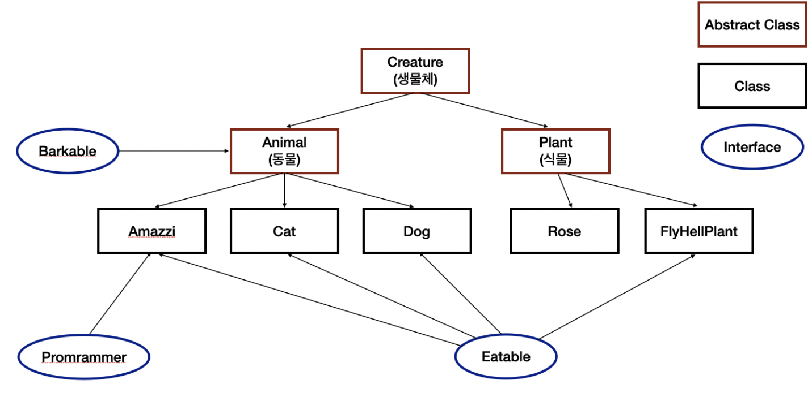

# 1주차 스터디 (9.22 ~ 9.29)
## 서적 (1강 ~ 4강)

---
### 추상 클래스 vs 인터페이스

- 추상 클래스(abstract class)
  - 구현 코드 없이 매서드의 선언만 있는 `abstract method`를 포함하는 클래스
  - 생성 규칙
    - 키워드 `abstract`를 붙여 표현(포함하지 않은 클래스에 대해서도 추상 클래스로 만들 수 있음)
    - `new`를 통해 객체를 직접 생성할 수 없음
    - `abstract`로 선언된 메소드는 하위 클래스에서 반드시 구현(오버라이딩)
```java
public abstract class 추상_클래스 {
    abstract void method(); // 구현 코드 없이 선언만 할 수 있음
    void 구현_메소드(); // 구현된 메서드를 가질 수 있음
}

public class 하위_클래스 extends 추상_클래스 {
    @Override
    void method() {
        // 구현 코드
    }
    
    void 추가_메서드() {
        // 추가로 메서드를 구현할 수 있음
    }
}
```
- 인터페이스(interface)
- client program은 interface에 선언된 메서드의 명세(specification)만 보고 클래스 사용하도록 제작
- 상수와 추상 메서드(abstract method)의 집
  - 생성 규칙
    - 일반 메서드 또는 멤버 변수를 선언할 수 없음
    - 모든 메서드가 `public abstract`으로 선언됨(생략 가능, default)
    - 모든 변수는 `public static final`으로 선언됨(생략 가능, default)
      - `public static final`의 사용 목적?
        - 인터페이스 변수는 아무 인스턴스도 존재하지 않는 시점이기 때문에 스스로 초기화 될 권한 x
        - `public static final`를 사용해 구현 객체와 같은 상태 보장
```java
public interface 인터페이스_1 {
    (public static final) 타입 상수이름 = 값;
    (public abstract) void method();
}

public interface 인터페이스_2 {
    void method2();
}

public class 하위_클래스 implements 인터페이스_1, 인터페이스_2 {
    void method(){
        // 구현 코드
    };
}
```
- 추상 클래스와 인터페이스의 공통점
  - 선언만 존재하고, 구현 내용은 없음
  - 자기 자신을 new() 해서 객체를 생성할 수 없음(인스턴스화 불가능)
  - 상속받은 하위 클래스가 구현을 반드시 해야할 경우 사용(추상 클래스의 경우 extends, 인터페이스 implements)

- 추상 클래스와 인터페이스의 차이점 
  - 접근자에 따른 차이점
    - 추상 클래스 : `static`, `final`이 아닌 필드 o, `public, protected, private`
    - 인터페이스 : 모든 변수(`public static final`), 모든 메소드(`public abstract`)
  - 다중 상속 여부에 따른 차이점
    - 추상 클래스 : 불가
    - 인터페이스 : 여러 개의 인터페이스를 함께 상속받을 수 있음
  - 사용 목적에 따른 차이점
    - 공통점을 모아서 추상 메서드 선언, 차이점을 모아서 인터페이스 선언
    - 추상 클래스 : 멤버 변수가 있기 때문에 자녀 클래스에 공통 속성
    - 인터페이스 : 다중 상속이 가능하기에 세분화된 기능!


- 적절한 사용 케이스 정리
  - 추상 클래스
    - 관련성이 높은 클래스 간에 코드 공유
    - 상속을 받아서 기능을 확장시키는 용도
    - 상속 받는 클래스들의 공통 메소드와 변수가 많거나, `public` 이외의 접근자(`protected, private`) 필요한 경우
    - `non-static, non-final` 필드 선언이 필요한 경우
  - 인터페이스
    - 클래스의 목적에 맞게 각각 기능을 구현하기 위해
    - 수직적인 구조가 아닌 수평적인 구조를 원할 때..?
    - 여러 동작을 하는 기능을 세분화해서, 각각 필요한 기능이 있는 인터페이스만 사용하고 싶을 경우

## (추상 클래스 응용) 디자인 패턴 : 템플릿 메서드 패턴(Template Method Pattern)

---
- 디자인 패턴 : 특정 문맥에서 공통적으로 발생하는 고질적인 문제에 대한 재사용 가능한 해결책
- 템플릿 메서드 패턴 : 여러 작업들이 완전히 동일한 단계를 갖지만, 일부 동작은 각각 다르게 구현할 때 사용되는 패턴, 대체로 프레임워크 설계 시에 많이 사용되는 패턴
```text
-> 토비의 스프링에 의하면 다음과 같이 템플릿 메소드 방법을 정의

* 상속을 통해 슈퍼클래스의 기능을 확장할 때, 사용하는 가장 대표적인 방법
* 변하지 않는 기능은 슈퍼클래스에 만들어두고, 자주 변경되며 확장할 기능은 서브 클래스에서 만들도록 한다.
```
- 구현 팁(Tip)
  - 추상 클래스와 구체 클래스를 활용하여 코드의 흐름(시나리오) 작성
    - 실행 과정의 흐름을 구현한 상위 클래스(추상 클래스)
      - 전체적인 흐름을 정의
      - `protected` 접근 제한을 사용
      - 공통된 부분은 `final`로 선언하여 하위 클래스에서 재정의할 수 없게 코딩
      - 다르게 구현되어야 하는 메서드 `abstract`로 선언(구체 클래스에서 구현)
        - 재정의할 `abstract` 메서드는 식별하기 쉽도록 접두사를 붙이기
        - 메서드 이름을 `Do`로 통일
        - 구현해야 할 메서드 수가 너무 많아지지 않도록 주의
      
    - 실행 과정의 일부(특정) 단계를 구현한 하위 클래스(구체 클래스)
      - 다르게 동작하는 메서드만 재정의하는 방식(오버라이딩)

- 템플릿 메서드 적용 전, 라면 예시
```java
// JinRamyun.java
public class JinRamyun {
    public void cook() {
        System.out.println("가스불을 켠다.");
        System.out.println("냄비에 물을 받고 끓인다.");
        System.out.println("진라면을 준비한다."); // 이 부분만 다름
        System.out.println("스프와 면을 넣는다.");
        System.out.println("가스불을 끈다.");
    }
}

// SamyangRamyun.java
public class SamyangRamyun {
  public void cook() {
    System.out.println("가스불을 켠다.");
    System.out.println("냄비에 물을 받고 끓인다.");
    System.out.println("삼양라면을 준비한다."); // 이 부분만 다름
    System.out.println("스프와 면을 넣는다.");
    System.out.println("가스불을 끈다.");
  }
}
```

- 템플릿 적용 후, 중복된 코드 제거
```java
// 상위 클래스 abstract으로 구현
abstract class Ramyun {
  public void cook() { // 공통 메서드
    System.out.println("가스불을 켠다.");
    System.out.println("냄비에 물을 받고 끓인다.");

    getRamyun();

    System.out.println("스프와 면을 넣는다.");
    System.out.println("가스불을 끈다.");
  }

  protected abstract void getRamyun(); // 재정의할 매서드
}

// JinRamyun.java
public class JinRamyun extends Ramyun {
  @Override
  protected void getRamyun() {
    System.out.println("진라면을 준비한다.");
  }
}

// SamyangRamyun.java
public class SamyangRamyun extends Ramyun {
  @Override
  protected void getRamyun() {
    System.out.println("삼양라면을 준비한다.");
  }
}
```

- 각 하위 클래스에서 구혀체별로 다르게 처리하는 `getRamyun()` 메소드만 재정의
- 동일한 실행 과정의 구현 제공 + 하위 클래스에서 일부 단계를 구현하며, 불필요한 중복을 해소
- 추가로, 체스 게임을 구현할 때 템플릿 메서드 패턴을 적용한 사례는 하단 참고자료에 추가해뒀습니다.

### 참고자료

---
- [추상 클래스와 인터페이스의 차이](https://velog.io/@new_wisdom/Java-%EC%B6%94%EC%83%81-%ED%81%B4%EB%9E%98%EC%8A%A4%EC%99%80-%EC%9D%B8%ED%84%B0%ED%8E%98%EC%9D%B4%EC%8A%A4%EC%9D%98-%EC%B0%A8%EC%9D%B4)
- [추상클래스 vs 인터페이스 왜 사용할까? 차이점, 예제로 확인 :: 마이자몽](https://myjamong.tistory.com/150)
- [template-method-pattern - 체스판에 적용 예시](https://hudi.blog/template-method-pattern/)
- [[디자인 패턴]템플릿 메소드(Template Method) 패턴이란?](https://steady-coding.tistory.com/384)