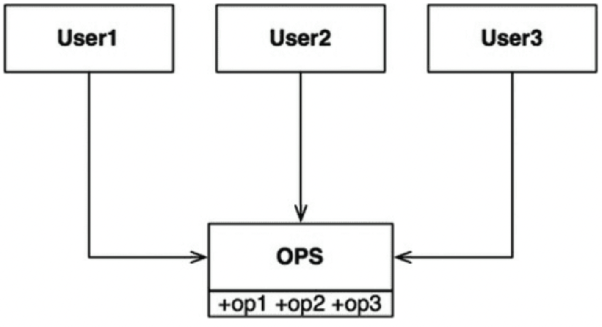
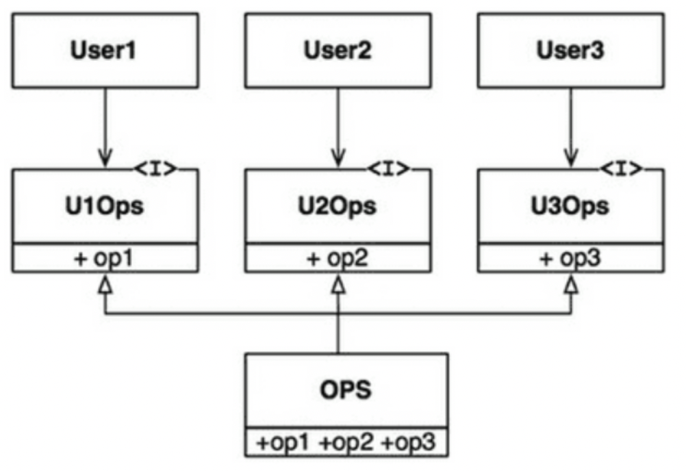
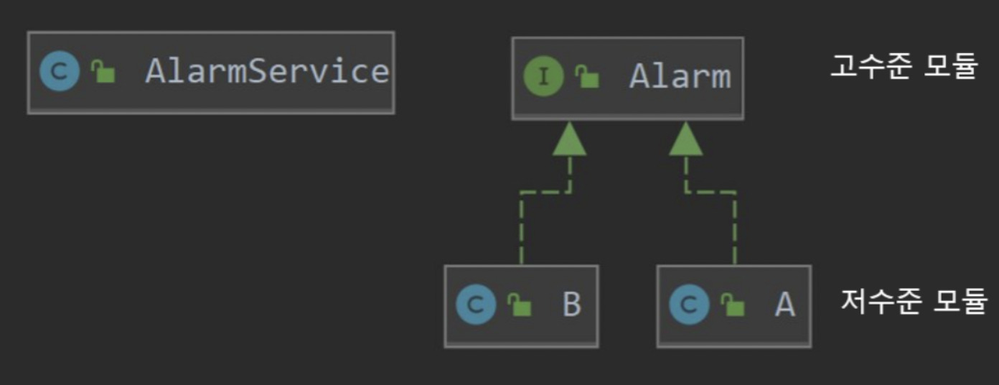
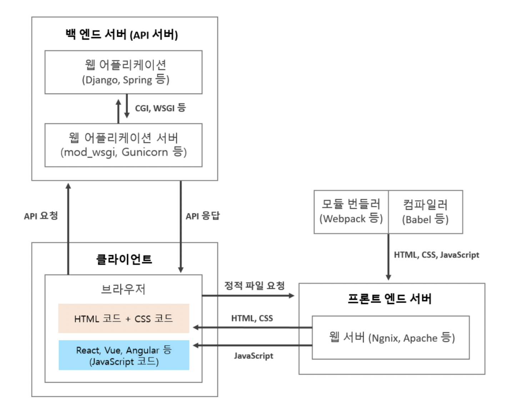

# 2주차 스터디 (9.30 ~ 10.6)
## 서적 (5강 ~ 6강)

---
## SOLID 원칙


- **객체 지향 언어를 이용해 객체 지향 프로그램을 올바르게 설계하는 방법**
- **좋은 소프트웨어 설계를 위해서는 결합도는 낮추고 응집도를 높여라**


- **중간 수준의 소프트웨어 구조가 아래와 같도록 만드는 목적**
    - **코드 변경에 유연하다**
    - **이해하기 쉽다**
    - **많은 소프트웨어 시스템에 사용될 수 있는 컴포넌트의 기반**

- **개략적인 원칙 설명**
    - **SRP : 단일 책임 원칙**
        - 소프트웨어 모듈은 변경의 이유가 단 하나
    - **OCP : 개방-페쇄 원칙**
        - 기존 코드 수정 x
        - 반드시, 새로운 코드를 추가하는 방식으로 시스템 변경
    - **LSP : 리스코프 치환 원칙**
        - 상호 대체 가능한 구성요소를 이용해 소프트웨어 시스템을 만들 수 있으려면,
        - 서브타입은 언제나 자신의 기반 타입으로 교채 가능
    - **ISP : 인터페이스 분리 원칙**
        - 사용하지 않은 것에 의존하지 않게 설계
    - **DIP : 의존성 역전**
        - 고수준 정책을 구현하는 코드는 저수준 코드에 절대 의존 x


### SRP : 단일 책임 원칙

---

- 클래스는 단 한 개의 책임을 가져야 한다
- 클래스를 변경하는 이유는 단 한 개여야 한다
- 코드 변경으로 버그가 발생해도, 다른 관련 없는 동작은 영향 x

### Why SRP?

- **Domain 로직이 복잡해질수록 이해관계가 서로 엉키게 됨**
- **Class 에 대한 부담이 커지게 되며, 유지보수의 어려움 혹은 버그 발생률이 증가**

### SRP 위반 사례

- 변수 레벨
    - 하나의 속성이 여러 의미를 갖는 경우
    - 어떤 곳에서는 쓰고, 어떤 곳에서 안 쓰는 속성이 있는 경우

```java
// 남자는 군대를 가지만, 여자는 군대를 가지 않는다.
public class Person {
	String military_serial_number;
}
```

- 메소드 레벨
    - 분기처리를 위한 if문이 많을 경우

```java
public class Person {
	private boolean sex;

	public void setSex(boolean sex) {
		this.sex = sex;
	}

	public void pee() {
		if (sex == true) {
			System.out.println("남자 화장실");
		} else {
			System.out.println("여자 화장실");
		}
	}
}
```

### 해결 코드

```java
public abstract class Person {
	abstract void pee();
}
```

```java
// 상속을 받아서 사용하면 해결
public class Male extends Person {
	@Override
	void pee() {
		System.out.println("남자 화장실");
	}
}
```

### 추가 Spring boot 적용 코드 링크

[SOLID - SRP(Single Responsibility Principle) : 단일책임 원칙](https://huisam.tistory.com/entry/SRP)

### OCP : 개방 폐쇄의 원칙


- 소프트웨어 구성 요소(컴포넌트, 클래스, 모듈, 함수)는 **확장**에 대해서는 **개방(OPEN)**
- **변경**에 대해서는 **폐쇄(CLOSE)**
- → **기존 코드는 변경하지 않으며 기능을 추가**할 수 있어야 함

### How OCP?

- **확장** 될 것과 **변경**을 엄격히 구분
- **두 모듈이 만나는 지점**에 **인터페이스 정의**
- 구현에 의존 x → **인터페이스에 의존**
- 변경이 발생하는 부분은 **추상화**하여 분리


- **Interactor**
    - **업무 규칙**을 포함
    - **가장 높은 수준의 정책** 포함
    - 이외의 컴포넌트는 **모두 주변적인 문제**를 처리
- 계층 관점
    - **Interactor → Controller, Database** 부수적인 컴포넌트
    - **Controller → Presenter & View**에 비해 중요한 업무 (더 높은 수준의 개념)
    - 저수준 컴포넌트 → 고수준 컴포넌트 방향으로의 변경으로 인한 피해에서 보호

### ISP : 인터페이스 분리 원칙

- **User1이 필요하지 않은 op2, op3를 가지고 있음**


- **변경 후**


### DIP : 의존성 역전

---

- **의존 관계**를 맺을 때, 변화하기 쉬운 것에 의존 x → **변화하지 않는 것에 의존 0**
- **유연성**이 극대화된 시스템
- **의존성**은 **추상에 의존**하며, **구체에는 의존하지 않는다.**


### 3가지 코딩 실천법

- **변동성이 큰 구체 클래스를 참조하지 말라**
- **변동성이 큰 구체 클래스를 파생하지 말라**
- **구체 함수를 오버라이드 하지 말라**

```jsx
public class A {
	public String beep() {
		return "beep!";
	}
}
```

```java
public class AlarmService {
	private A alarm;

	public String beep() {
		return alarm.beep();
	}
}

// 서비스 코드에서 구체 클래스 A를 참조 하는 중 xxxx
```

- **문제점**
    1. **테스트의 어려움**
        - 위 코드에선 AlarmService 만 온전히 테스트할 수 없음
    2. **확장 및 변경이 어려움**
        - B 알람을 추가하려면 새로운 구체 클래스를 하나 더 생성해야함

- **해결 코드**

```java
// 추상 인터페이스 하나 생성
public interface Alarm {
	String alarm();
}
```

```java
// 저수준 모듈이 Alarm 상속
public class A implements Alarm {
	@Override
	public String beep() {
		return "beep!";
	}
}
```

```java
// 고수준 모듈에 의존성 부여
public class AlarmService {
	private Alarm alarm;

	public AlarmService(Alarm alarm) {
		this.alarm = alarm;
	}
	
	public String beep() {
		return alarm.beep();
	}
}
```

- **저수준 모듈이 고수준 모듈에 의존하게 되는 것 → DIP(의존관계 역전 원칙)**

## REST API 디자인 가이드

---
- REST(Representational safe transfer)
  - HTTP Protocol 통해 API 설계하기 위한 네트워크 아키텍처 스타일
  - 설계 시, 가장 중요한 항목 2가지
    - URL 정보의 자원을 표현
    - 자원에 대한 행위 HTTP Method(GET, POST, PUT, DELETE) 표현
- API (Application Program Interface)
  - 서로 다른 응용 프로그램 간의 상호 작용 및 통신을 허용하는 기능과 규칙
  
### 1. URL → 케밥케이스(kebab-case) 사용

**Bad:**

```jsx
[GET] /systemOrders
[GET] /system_orders
```

Good:

```jsx
[GET] /system-orders
```

### 2. Path Variable → 카멜케이스(camelCase)

```jsx
[GET] /orders/**{orderId}**
```

### 3. Collection → 복수

```jsx
[GET] /users
```

### 4. 적절한 상태값 응답

- Informational 1XX: 정보를 제공하는 응답
- Successful **2XX** : 성공적인 응답
    - 200 (OK): 요청이 성공적으로 수행
    - 201 (작성됨) : 요청한 값이 DB 반영됨
    - 202 (허용됨) : 서버가 요청을 접수했지만 아직 처리 x
- Redirection **3XX :** 메시지 클라이언트의 요청을 완료하기 위해서 추가적인 행동이 필요한 경우
    - 300 (여러 선택항목) : 서버가 사용자 에이전트에 따라 수행할 작업 선택
    - 301 (영구 이동) : 요청한 페이지를 새 위치로 영구적 이동
    - 302 (임시 이동) : 현재 서버가 다른 위치의 페이지 요청에 응답, 향후 다시 원래 위치 사용
    - 303 (기타 위치 보기) : 다른 위치에 별도의 GET 요청을 하여 응답을 검색
    - 304 (수정되지 않음) : 마지막 요청 이후 페이지 수정 x
- Client Error **4XX**
    - 클라이언트가 서버에게 잘못된 요청을 하는 경우
    - 401 Unauthorized: 인증이 필요한 페이지를 요청한 경우
    - 403 Forbiden: 허용되지 않은 메소드가 있을 때
    - 404 Not Found : 요청 페이지 찾을 수 없을 때
    - 406 Not Acceptable: 허용 불가능
- Server Error 5XX
    - 서버에서 오류가 발생하여 정상적으로 요청을 처리할 수 없는 경우
    - 500 Internal Server Error: 웹 서버가 처리할 수 없음
    - 503 Service Unavailable: 서비스 제공불가, 서버 과부하, 서버 폭주

### 5. JSON Property → camelCase

```jsx
{
	userId : "1"
}
```

### 6. API 버전 → 서수

```jsx
http://kapi.kakao.com/v2/user/me
```

### 7. List Resource → Total 같이 응답 + 파라미터로 limit, offset 정보 받기

```jsx
[GET] /shops?offset=5&limit=5

{
	users: [
		...
	],
	total: 32
}
```

### 부록. '/API'를 백엔드 REST api 작성 시 넣는 이유

- 백엔드 서버와 프론트 서버를 구분하기 위해
- 프론트 서버에서는 URL 별로 화면을 띄우고, 백엔드 URL은 데이터 요청
- 만약 nginx 같은 걸로 포트를 쓰게 되면 백엔드에 api로 구분
- 하지만, 다른 ip를 쓰거나, 포트가 다르면 굳이 api 붙이지 않아도 괜찮음



### 참고 링크

---
[REST란? REST API 디자인 가이드 ](https://covenant.tistory.com/241)
[HTTP 상태 코드 정리](https://www.whatap.io/ko/blog/40/)