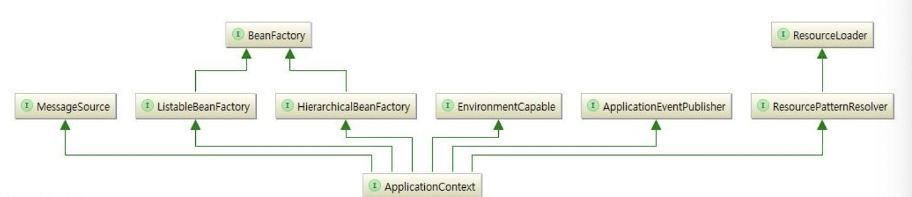
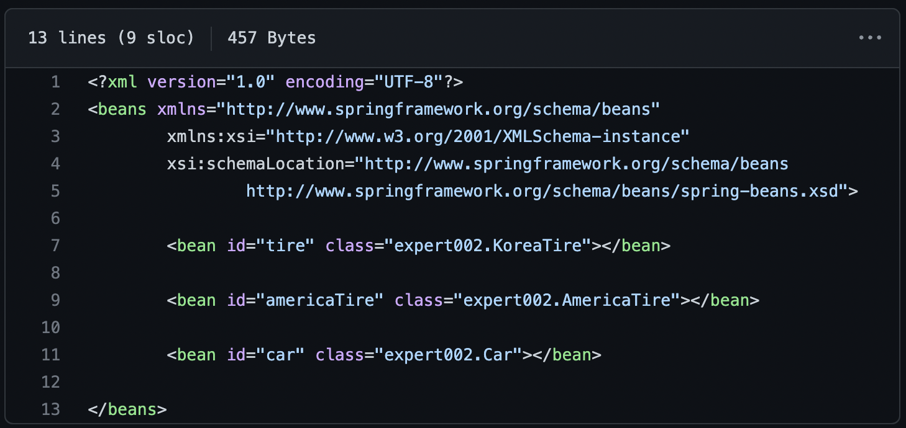
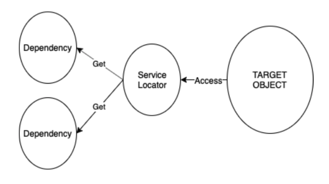

## 3주차 스터디 (10.7 ~ 10.14)

---
## 서적 (7강 - IOC, DI 파트까지)

### 스프링을 통한 의존성 주입

---
- IOC
  - 결합성을 낮추기 위해, 상위 수준 모듈이 하위 수준 모듈에 의존하지 않도록 개발
- DI
  - IOC 라고도 하는 의존 관계 주입(Dependency Injection)
  - 어떤 객체가 사용하는 의존 관계를 직접 만들어 사용하는 것이 아닌, 주입 받아 사용하는 방법
  - 책에서 의존성은 단순하게 new 라고 정의
  - 강한 결합 vs 느슨한 결합
    - 강한 결합 : 객체 내부에서 다른 객체를 생성
      - 코드의 재활용성이 떨어지고, 클래스가 수정되었을 경우 해당 클래스도 같이 수정해야 하는 문제
    - 느슨한 결합 : 객체의 외부에서 생성된 객체를 인터페이스를 통해 넘겨 받기
      - 결합도를 낮출 수 있고, 런타임 시에 의존관계가 결정되기에 유연

```java
// DI 적용하지 않았을 때, 코드의 유연성 떨어짐
public class Car {
    Tire tire;
    
    public Car() {
        tire = new KoreaTire();
        // tire = new AmericaTire(); -> 이 부분이 유연하지 않음
    }
}

// 적용 시
public class Car {
    Tire tire;
    
    public Car(Tire tire) {
        this.tire = tire;
    }
}

```

### 스프링을 통해서 의존성 주입

- 스프링 IoC 컨테이너

  - 컴포넌트의 중앙 저장소
  - 가장 중요한 인터페이스
    - `BeanFactory` -> 직접적으로 사용 거의 안 함.
      - 스프링 빈 컨테이너에 접근하기 위한 최상위 인터페이스
      - Bean 객체를 생성하고, 관리하는 인터페이스
      - 디자인패턴의 일종인 팩토리 패턴을 구현
      - 구동될 때, Bean 객체를 생성하는 것이 x
      - 클라이언트의 요청이 있을 때 getBean() 객체 생성
    - `ApplicationContext`
      - BeanFactory 상속받은 interface 이며 부가기능 추가
      - 구동되는 시점에 등록된 Bean 객체들을 스캔하여 객체화
  - 빈 설정 소스로부터 빈 정의를 읽고 빈을 구성하고 제공
  - 빈들의 의존 관계를 설정 (객체의 생성을 책임, 의존성 관리)
  - 스프링 컨테이너가 Bean 을 싱글톤으로 관리해주며 문제점 해결 + 장점만 가져감
    - 문제점 해결
      - 싱글톤 패턴 코드 구현 번거로움
      - 구체 클래스에 의존 + 유연성 떨어짐 등
    - 장점
      - 매번 인스턴스 생성할 필요 없이 단 하나만 생성해서 비용 절감
  
1. xml 설정파일을 통한 빈 등록 후 DI -> 이전 구식 방법

```java
// XML 파일 사용 -> 예전 방법
// IoC 컨테이너에 등록된 Bean 확인
ApplicationContext context = new ClassPathXmlApplicationContext("xxx.xml", Driver.class);

// 빈 등록 메서드 이름을 통해 객체를 가져옴
Tire tire = (Tire)context.getBean("tire");

Car car = (Car)context.getBean("car");
car.setTire(tire);

```

2. @Autowired, @Resource 를 통한 속성 주입
```java
// @Autowired 적용 전
Tire tire;

public void setTire(Tire tire) {
    this.tire = tire;
}

// @Autowired 적용
@Autowired
Tire tire;

// @Resource 적용
@Resourece
Tire tire;
```

- @Autowired vs @Resource
  - @Autowired
    - 스프링 프레임워크
    - id 매칭 < type 매칭
  - @Resource
    - 표준 자바
    - type 매칭 < id 매칭 

### Service Locator Pattern (서비스 로케이터 패턴)

- DI 와 같이, 클래스가 갖는 <b>종속성을 제거</b>하기 위한 디자인 패턴 중 하나
- 기본 개념 
  - 애플리케이션에 필요할 수 있는 모든 서비스를 보유하는 방법을 알고 있는 Service Locator 생성
  - 요청 시, 각각의 Service Instance 를 Service Locator 가 반환하는 것
- 구성 요소
  - Cache : 재사용하기 위해 서비스 참조를 저장하기 위한 객체
  - Service Locator : 캐시에서 서비스를 반환하기 위한 진입점
  - Initializer : 캐시의 서비스에 대한 참조를 생성 후 등록
  - Service : 원래 구현되어 있는 서비스

  

```java
// interface 제작
public interface MessageingService {
  String getMessageBody(); // 메서드 1
  String getServiceName(); // 메서드 2
}
```
```java
// interface 구현한 서비스 2개
public class EmailService implements MessagingService {
    @Override
    public String getMessageBody() {
      return "email message";
    }
  
    @Override
    public String getServiceName() {
      return "EmailService";
    }
}

public class SMSService implements MessagingService {
    
    @Override
    public String getMessageBody() {
      return "SMS message";
    }
  
    @Override
    public String getServiceName() {
      return "SMSService";
    }
}
```
- 두 서비스를 정의한 후, 서비스 객체를 생성 하는 클래스
```java
public class InitialContext {
    public Object lookup(String serviceName) { // 서비스 이름을 받았을 때, 일치하는 서비스 객체 생성
        if (serviceName.equalsIgnoreCase("EmailService")) { // 대소문자 구분 x
            return new EmailService();
        } else if (serviceName.equalsIgnoreCase("SMSService")) {
            return new SMSService();
        }
        return null;
    }
}
```
- 캐시에 이전에 생성된 서비스 객체가 있다면, 담는 용도로 사용
```java
public class Cache {
    private List<MessagingService> services = new ArrayList<>();

    public MessagingService getService(String serviceName) {
        // retrieve from the list
    }

    public void addService(MessagingService newService) {
        // add to the list
    }
}

```
- 마지막 모든 서비스를 보유하는 방법을 알고 있는 서비스 로케이터 코드
```java
public class ServiceLocator {

    private static Cache cache = new Cache(); // 이전에 생성한 적이 있는 서비스 담는 객체

    public static MessagingService getService(String serviceName) { 

        MessagingService service = cache.getService(serviceName);

        if (service != null) {
            return service;
        }

        InitialContext context = new InitialContext(); 
        MessagingService service1 = (MessagingService) context
          .lookup(serviceName);
        cache.addService(service1);
        return service1;
    }
}
```

- 실제 서비스 객체를 생성하는 테스트 코드
```java
MessagingService smsService = ServiceLocator.getService("SMSService"); // 처음으로 서비스를 가져오면, 새 인스턴스 생성 후 반환
String sms = smsService.getMessageBody(); // "SMS message"

MessagingService emailService = ServiceLocator.getService("EmailService");
String newEmail = emailService.getMessageBody(); "email message"
```

- 단점
  - 모든 서비스들이 싱글톤 Service Locator 에 대해 참조를 해야한다.
    - 여전히 종속성을 생성
    - 대상이 하나에 몰려 있다는 점
  - 단위 테스트를 하기 어렵게 만듬
    - Service Locator 구현을 대체할 수 없음 
    - DI 는 종속 클래스의 모의 객체를 테스트된 인스턴스에 전달할 수 있지만, 서비스 로케이터는 불가능
  - 인터페이스를 쉽게 바꿀 수 있어 문제가 될 법한 인터페이스 변경을 야기.

- Service Locator 패턴은 코드를 분리하는 간단한 패턴
- 이해하기 쉽고, 소규모 애플리케이션에 적합
### 참고 자료

---
[스프링 의존성 주입(DI) 이란?](https://devlog-wjdrbs96.tistory.com/165)
[서비스 로케이터 기본 개념](https://martinfowler.com/articles/injection.html#UsingAServiceLocator)