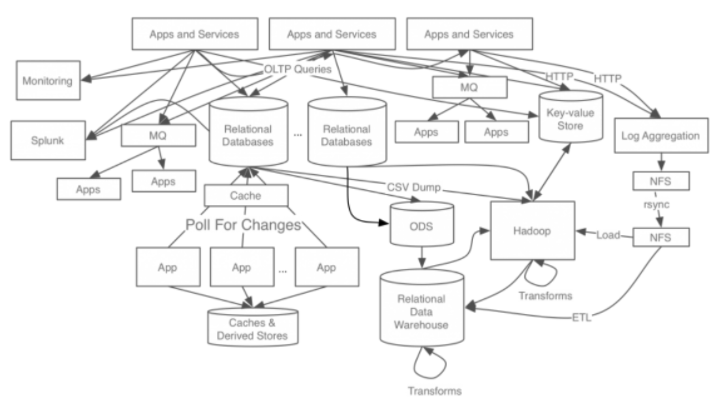
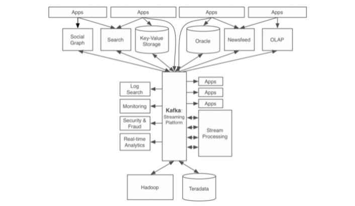
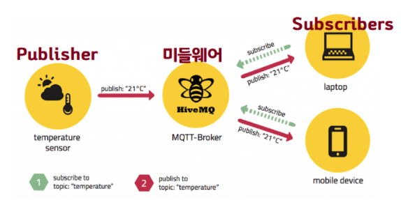
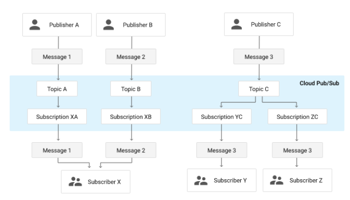

# 4주차 스터디

## 서적 내용 정리

---

### AOP(Aspect Oriented Programming)

- 관점 지향 프로그래밍
- 로직을 기준으로 핵심 기능과 부가적인 기능을 나누어 모듈화 진행
  - 모듈화 : 어떤 공통된 로직이나 기능을 하나의 단위로 묶음
- 횡단 관심사(Crosscutting Concerns)
  - 소스 코드 상에서 다른 클래스에서도 공통적으로 사용하는 코드
  - `Aspect`를 이용하여 모듈화하여 비즈니스 로직에서 분리 후 재사용
- 주요 개념
  - `PointCut`: Aspect 적용 위치 지정자
    - `"execution(**..repository.*.*(..))"`
    - <b>최근 애플리케이션은 Layered Architecture 기반</b>
    - <b>각 Layer 별 or 2~3 Layers 통합한 PointCut 정의하여 재사용</b>
  - `JoinPoint`: 스프링 프레임워크가 관리하는 빈의 모든 메서드
    - (광의) Aspect 적용이 가능한 모든 지점
    - (협의) 호출된 객체의 메서드
    - `ProceddingJoinPoint joinPoint`
    - `@Around("execution(**..repository.*.*(..))")`가 PointCut 일 때
      - `userRepository.save()` 가 호출된 상태라면
      - JoinPoint -> userRepository 객체의 save()
        - JoinPoint Parameter 를 사용하면, 실행 시점에 호출된 매서드의 정보 확인 가능
  - `Aspect`: Advisor 집합체
  - `Advice`: PointCut 적용할 로직, 즉 메서드
  - `Advisor`: 1개의 Advice + 1개의 PointCut -> Aspect가 나와서 사실상 무쓸모
- 스프링 AOP 특징
  - 인터페이스 기반
  - 프록시 기반
    - 제어 흐름을 조정하기 위한 목적으로 중간에 대리자를 두는 방식
    - `@Before`: 해당 메서드가 실행하기 전
    - `@After`: 해당 메서드가 실행된 후
    - `@Around`: 매서드 실행 전과 후(예외 발생 시에도 실행됨)
    - `@AfterThrowing`: 메소드에서 예외가 발생되면 실행
    - `@AfterReturning`: 메소드가 정상 종료될 때
  - 런타임 기반
    - 컴파일 타임 vs 런타임
    - 컴파일: 코드를 기계어로 바꾸는 것
    - 런타임: 기계어로 바꾼 코드를 실행
- DAO 실행 시간 측정 예제 코드

```java
@Slf4j
@Aspect // 이제 Aspect 사용하겠다
@Component // Bean 등록, 객체 생성과 의존성 주입을 스프링에 위임
public class MeasureTimeAspect {
    // repository 안에 적용, 물론 다른 레이어에도 적용 가능
    // repository 안의 객체의 메서드들은 빈으로 등록해줘야함 -> AOP 적용 대상이기 때문
    // proceed()의 리턴값은 Object
    @Around("execution(**..repository.*.*(..))")
    public Object aroundAdvice(ProceedingJoinPoint joinPoint) throws Throwable {
        // before advice
        StopWatch sw = new StopWatch();
        sw.start(); // Start Time Check

        // 기준 이전 코드는 before
        Object result = joinPoint.proceed(); // 시점 중요
        // 기준 이후 코드는 after로 구분

        // after advice
        sw.stop(); // Stop Time Check
        Long total = sw.getTotalTimeMillis();

        // 어떤 클래스의 메서드를 측정했는지 joinPoint 객체 안에 담겨 있음
        String className = joinPoint.getTarget().getClass().getName();
        String methodName = joinPoint.getSignature().getName();
        String taskName = className + "." + methodName;

        // 실행시간 로그 남기기
        log.info("[ExecutionTime] : {}, {}(ms)", taskName, total)

        return result;
    }
}
```

- 실행시간 예시
  

### Apache Kafka - Message Queue

---
- Publish-Subscribe 모델을 구현한 분산 메시징 시스템 → 메시지 큐
1. Kafka 개발 이전 - 링크드인 데이터 처리 Architecture

- 수많은 트래픽과 데이터 처리에 한계
- 각 파이프라인 파편화 + 시스템 복잡도가 높아 확장하기 어려운 상황

2. Kafka 개발 이후


- 모든 이벤트 / 데이터 흐름 → 중앙 관리
- 서비스 아키텍처의 간소화
- 특징
  - 높은 처리량으로 실시간 처리
  - 임의의 타이밍에 데이터 읽음
  - 클러스터링에 의한 고가용성 서비스 → Scale out 가능
  - 다양한 제품과 시스템에 쉽게 연동
  - 메시지를 잃지 않음


- Pub/Sub : 메시지 기반의 미들웨어 시스템이며, 클라우드 기반의 대용량 메세지 큐이다.
  - 일반적으로 메시지를 전송할 땐 publisher(sender)가 subscriber(receiver)에게 직접 전송
  - Pub/Sub 모델에서는 publisher는 어떤 subscriber가 있는지 모르는 상태에서 메세지를 전송하고 subscriber는 publisher에 대한 정보 없이 자신의 interest에 맞는 메세지만을 전송
  
  - 요약 : 
    - Pub은 전송 대상은 모르면서(Pub과 Sub은 서로에 대해 알 필요 ❌)
    - 미들웨어(Pub과 Sub에 모두 알려진 존재. Broker or Bus)로 메세지를 전송하고 이를 통해 Sub에 전송하는 시스템이다.
    
    
  - publisher : message를 생성해 topic에 전달하는 서버
  - message : Pub으로부터 Sub에게 최종적으로 전달되는 데이터와 속성(property)의 조합
  - topic : Pub이 메세지를 전달하는 리소스. Queue라고 생각하면 된다.
  - subscription : 특정 단일 주제의 메시지 스트림이 구독 애플리케이션으로 전달되는 과정을 나타내는 이름이 지정된 리소스. topic-subscription은 1...N 관계
  - subscriber : 메세지를 수신하는 서버
  - 통신은 일대다(fan-out), 다대일(fan-in), 다대다 형태를 취할 수 있다.


### 참고자료

---

- [AOP를 이용해 로그 데이터 남기기](https://velog.io/@solar/AOP-%EB%A5%BC-%EC%9D%B4%EC%9A%A9%ED%95%B4-%EB%A1%9C%EA%B7%B8-%EB%8D%B0%EC%9D%B4%ED%84%B0-%EB%82%A8%EA%B8%B0%EA%B8%B0)
- [AOP(Aspect Oriented Programming) - DAO 실행 시간 측정 예제](https://victorydntmd.tistory.com/178)
- [Apache Kafka(아파치 카프카)란 무엇인가?](https://velog.io/@jaehyeong/Apache-Kafka%EC%95%84%ED%8C%8C%EC%B9%98-%EC%B9%B4%ED%94%84%EC%B9%B4%EB%9E%80-%EB%AC%B4%EC%97%87%EC%9D%B8%EA%B0%80)
- [LINE에서 Kafka를 사용하는 방법 - 1편 - LINE ENGINEERING](https://engineering.linecorp.com/ko/blog/how-to-use-kafka-in-line-1/)