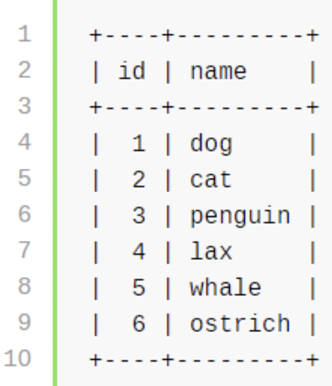
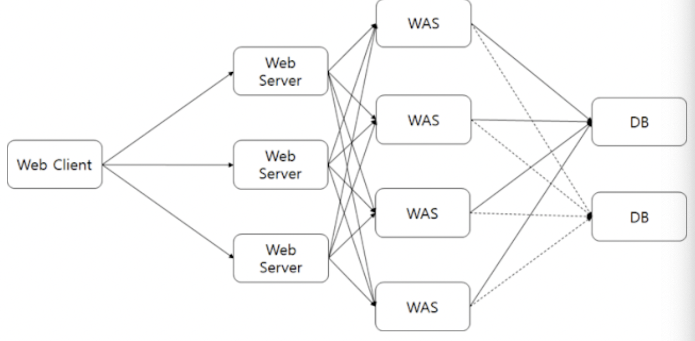

# 5주차 스터디 - 11월 10일

## Spring 엔티티 설계 및 느꼈던 점

---
### 1. 테이블, 컬럼을 생성할 때 명칭을 한 눈에 알아볼 수 있도록 설계하자.
- 문제가 됐던 테이블 명
  - `Visitor`: 방문자
  - `Patient`: 환자
  - `User`: 의사

### 2. 각 테이블의 PK 컬럼을 AUTO_INCREMENT 로 모두 선언하지 말자.
- AUTO_INCREMENT : INSERT로 데이터를 생성할 때마다 1씩 증가해서 PK를 생성해주는 역할
```java
@Entity
public class Users {
    @Id
    @GeneratedValue()
    private Long id;
    
    private String name;
}
```
```mysql
CREATE TABLE users {
    id MEDIUMINT NOT NULL AUTO_INCREMENT,
    name CHAR(30) NOT NULL,
    PRIMARY KEY (id)
};
 ```
  - 결과
  - 

  - 문제점 
    - 1씩 증가하는 형식은, ID의 앞 뒤로 다른 USER의 PK 값임을 쉽게 예측할 수 있음
    - 새 항목을 생성하고, 해당 ID를 검사하면 테이블의 행 수를 알 수 있음(정보가 공개적)
      - ex. 경쟁사의 고객 수를 측정하기 위해 데이터를 하나 만들고, URL 을 통해서 PK를 알아내기
    - 데이터베이스가 분리되어 있는 상황에서 INSERT 한다고 가정
      - 데이터베이스 A : 1,2,3,4,5 ...
      - 데이터베이스 B : 1,2,3,4,5 ...
      - 결과적으로, 두 데이터베이스를 합치게 되는 과정이 있다면, `DUPLICATE KEY` 데이터 일관성 문제
    - 


- UUID : 128bits 데이터로 충돌 가능성이 매우 낮은 무작위 수로 만들어지는 값
  - ex. e7f35d09-ed80-11ea-a738-1923841c129
```java
@Entity
public class Users {
    @Id
    @GeneratedValue(generator="UUID")
    @GenericGenerator(
        name="UUID",
        stategy="org.hibernate.id.UUIDGenerator"
    )
    private UUID id;
    
    private String name;
}
```
  - 해결되는 부분
    - 외부에서 각 테이블에 얼마나 많은 값이 들어가 있는 지 알 수 없음
    - 분산된 데이터베이스에 대해서도 유일한 PK 값을 유지할 수 있음
    - 결론적으로, 보안 상의 이득을 취할 수 있음
  - 문제점
    - int 형에 비해 길이가 너무 길어져서, 스토리지 및 성능 문제가 발생
      - 관계형 데이터베이스 테이블에 fk로 uuid 를 사용하면 추가 이슈 발생


- 이전 경험을 통해 PK를 설계하는 방법 제시
  - `Int`형 선언보다는, 우선적으로 `Varchar` 선언을 하자
  - Physical 하게 있는 물품과, Logical 하게 있는 정보들로 합쳐서 의미 있는 PK를 생각
    - ex. 60만 장의 물품 이미지 데이터를 구분하는 테이블을 만들어야 한다고 가정
      - Physical : labeling 하는 단위 기준으로 물품의 이름 분류
      - Logical : 날짜, 촬영 각도, Serial Number 등
      - PK : 20220414_Knife-A_0
  - Override 해서 이전 정보를 대체한다고 할 때, 물론 저장하지 않아도 괜찮지만
  - 이전 정보도 미래에 필요하다고 생각하면, 날짜 + Serial Number 까지 한번에 저장하는 것이 좋음
  - INT 형은 서로 계산하기 위해서 선언할 때만 사용한다.
  - 구분하기 위해서는 `VARCHAR`가 좋음.

- 인터넷을 찾아본 결과
  - 단순 일련번호를 쓰지 말고 -> 구분 + 일련번호를 사용하자
  - 테이블 PK 는 auto_increment 를 사용하여 불필요한 DISK I/O 발생을 줄이자
  - 

### 3. 테이블의 컬럼 순서도 의미 있는 순서로 구성하자.
- `Spring JPA Auto DDL generation` 의 경우 DB 생성을 하이버네이트가 자동적으로 해주는 역할
  - a. `@Entity` Class 를 Java 파일에서 찾기
  - b. `spring.jpa.generate-ddl=true` 옵션 적용 시, 자동 생성
  - 문제점
    - 실제 배포 단계에서 위험
    - 자동으로 테이블이 생성되는데, 알파벳 순서로 컬럼이 정렬
```yaml
spring:
  jpa:
    hibernate.ddl-auto: update
    generate-ddl: true
```
```sql
create table user (
      id bigint generated by default as identity,
      created_at timestamp,
      email varchar(255) not null,
      updated_at timestamp,
      name varchar(255) not null,
      picture varchar(255),
      primary key (id)
);
```

- `SQL script` : Spring 기본값으로 classpath root 에 `schema.sql` 파일이 있다면, 서버 실행 시 스크립트를 실행
- `data.sql` : 서버를 실행할 때, Data를 미리 추가하는 스크립트를 작성할 수 있음

```yaml
# application-dev.yml
spring:
  datasource:
    schema: classpath*:db/${database}/schema.sql
    data: classpath*:/db${database}/data.sql

  jpa:
    hibernate.ddl-auto: none
```
    
```sql
# resources/db/schema.sql 

DROP TABLE user IF EXISTS;

create table user (
      id bigint generated by default as identity,
      email varchar(255) not null,
      name varchar(255) not null,
      picture varchar(255),
      created_at timestamp,
      updated_at timestamp,
      primary key (id)
);
```
### 4. 그 외
- 파티셔닝
  - 처음 테이블을 구상할 때, 한 테이블에 필요한 모든 컬럼 값들을 몰아 넣고, 파티셔닝 즉 컬럼을 나누는 것은 나중에 하는 것이 좋다
  - 파티셔닝의 단점으로, 값을 조회할 때 join 문법을 사용하는데 사용되는 시간이 생각보다 많음
- 테이블에 생성 일자, 수정 일자는 필수로 만들기
  - 모든 DB Table 에는 createdAt, updatedAt 은 거의 필수로 만들어주자


### 참고자료
- [UUID와 increment PK는 언제 사용해야할까?](https://americanopeople.tistory.com/378)
- [Best practices on primary key, auto-increment](https://stackoverflow.com/questions/52414414/best-practices-on-primary-key-auto-increment-and-uuid-in-sql-databases)
- [Spring에서 JPA/Hibernate 초기화 전략](https://pravusid.kr/java/2018/10/10/spring-database-initialization.html)
- [성능 데이터모델링 - 일련번호(Sequence)를 이용한 PK 설계 고려로 프로젝트 위험을 제거하자](https://www.ilifo.co.kr/boards/article/48)