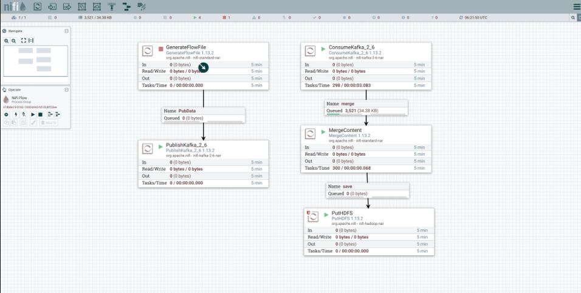
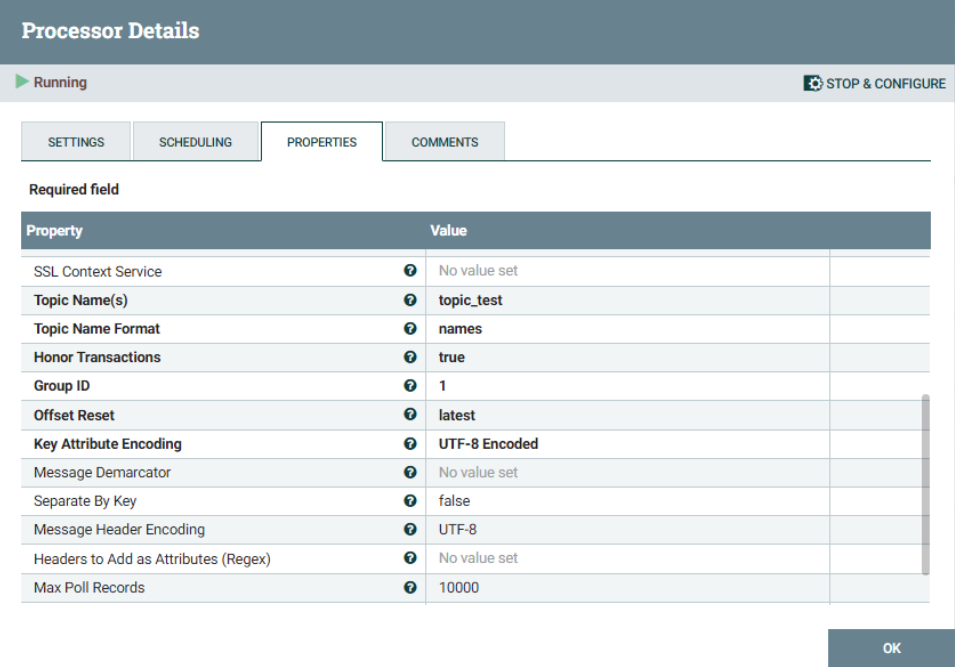
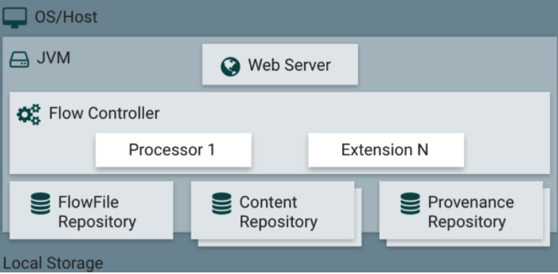
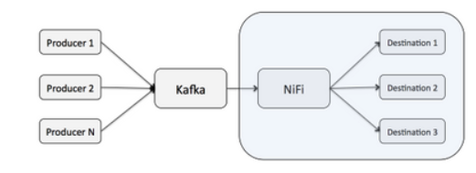

# 6주차 스터디 - 11월 16일

## Apache NiFi

---
- 시스템 간의 데이터 흐름(Data Flow)를 자동화하도록 쉽게 개발할 수 있는 시스템
- 시스템 간 데이터 처리, 관리에 최적화되어 있고, 모니터링을 할 수 있는 UI를 제공
- 실시간으로 대량의 데이터 수집, 전송에 필요한 기능, 데이터 가공 후 결과를 저장하는 기능 등 데이터 조작 기능 제공
- 오픈 소스로 사용 비용이 들지 않고, 설치 후 간단하게 사용할 수 있다는 장점

### 구성 요소

---

### FlowFile : NiFi 데이터를 표현하는 단위
- Content / Attributes 로 나뉘는 데이터 형식
  - Content : 들어온 데이터 자체
  - Attribute : 데이터와 관련된 정보를 key/value 쌍으로 표현
### Processor

- FlowFile 수집, 정제, 저장 등 변환하는 기능 -> 처리 이후 FlowFile 만들 수 있음
- 자주 사용하는 Processor 에는 http, kafka, db, ftp 관련 Processor,
- 속성 변경하는 updateattribute, 데이터를 합치는 mergecontent, 데이터 분할하는 split, 데이터 타입 변경 covert 등
    - GenerateFlowFile : FlowFile 을 임시로 테스트하도록 생성
    - PublishKafka : Kafka Cluster로 데이터를 전송
    - ConsumeKafka : Kafka Cluster로부터 데이터를 수집
    - MergeContent : 작은 단위로 들어오는 Kafka 의 Topic Data를 일정 크기만큼 쌓는 역할
    - PutHDFS : HDFS(하둡)에 데이터를 저장
### Connector
- Processor 간의 연결, FlowFile 을 임시로 저장 후 다음 Processor 로 전달이 되면 삭제하는 임시저장역할
  - FlowFile 이 다음 Processor 에 저장되기 전에 Queue 에 저장하는 의미
  - FlowFile 간의 우선순위를 조정 및 BackPressure 설정 -> 부하 조절
    - BackPressure : 스트리밍 데이터가 밀려 오는 압력, 즉 다음 데이터가 오는 양
    
### NiFi Architecture

- Flow Controller
  - Processor 가 어느 간격 또는 시점에 실행되는 지 스케쥴링을 담당
- FlowFile Repository
  - Write-Ahead-Log 로 활성화된 FlowFile 속성과 상태값을 저장하는 곳
  - 데이터가 유실되지 않도록 주의
- Content Repository
  - FlowFile의 데이터(Content) 가 저장되며, 여러 디렉토리에 분석 저장 가능
  - 용량이 큰 데이터를 저장할 수 있으며, 단일 디스크의 처리량보다 많은 양 처리
- Provenance Repository
  - 데이터의 처리 단계별 FlowFile 데이터를 보관하는 곳
  - 모든 출처의 이벤트 데이터 저장, 각 데이터는 인덱스 되어 검색할 수 있음

### 실제 NiFi 적용 Flow

---

### 소비자로서의 NiFi
- 코드를 작성하지 않고, Kafka 에서 HDFS 데이터로 전달할 수 있고, 적합한 크기의 파일로 일괄 처리
- Producer Kafka 로부터 데이터를 FlowFile 로 받아서, 수많은 Processor 로 FlowFile 을 가공 후 마지막에 PostgreSQL에 저장

### H사 프로젝트 활용 사례

- InvokeHTTP : Property 값에 OpenAPI 로 호출할 URL, Parameter 값을 설정 -> JSON, XML 등 원하는 값으로 데이터 수집
- SplitJson : Json 의 key 별로 파싱
- ConvertRecord : 파싱된 값을 CSV 형태로 저장

### 참고자료

---
- [Apache NiFi Docs](https://nifi.apache.org/docs.html)
- [[NiFi] Hello World](https://devidea.tistory.com/76)
- [Nifi-Apache-Nifi-Kafka-Hdfs-연동](https://velog.io/@makengi/Nifi-Apache-Nifi-Kafka-Hdfs-%EC%97%B0%EB%8F%99)
- [Integrating-Apache-NiFi-and-Apache-Kafka](https://community.cloudera.com/t5/Community-Articles/Integrating-Apache-NiFi-and-Apache-Kafka/ta-p/247433)