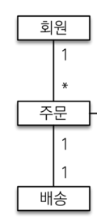
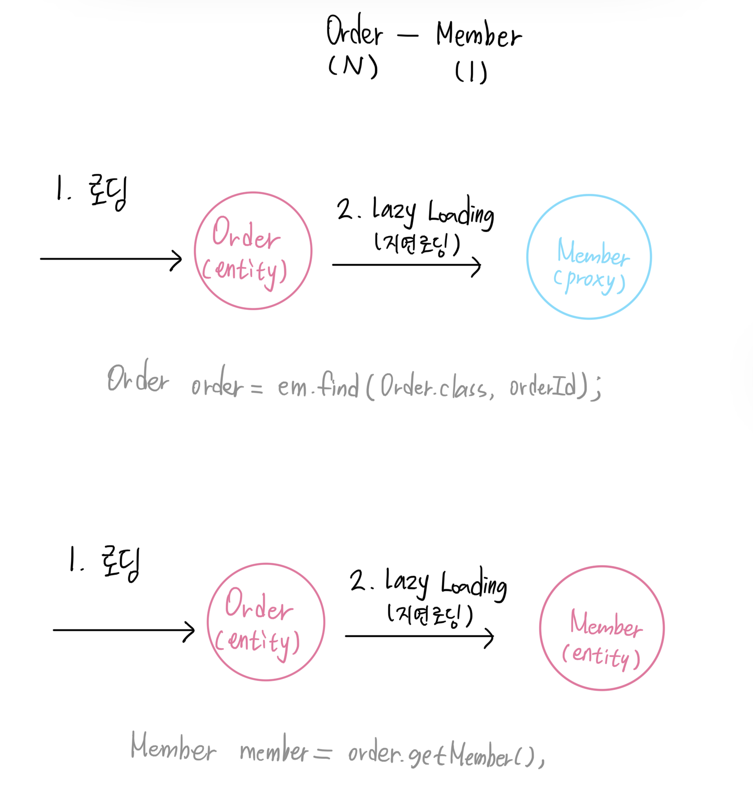

# 즉시 로딩(Eager Loading)과 지연 로딩(Lazy Loading)

> **즉시 로딩**: 엔티티를 조회할 때 자신과 연관되는 엔티티를 조인(join)을 통해 함께 조회하는 방식
>   * 엔티티 A 조회시 관련되어 있는 엔티티 B를 같이 가져온다. 실제 엔티티를 맵핑한다. Join을 사용하여 한번에 가져온다.
>   * A join B, 쿼리가 한 번만 나간다   

> **지연 로딩**: 자신과 연관된 엔티티를 실제로 사용할 때 연관된 엔티티를 조회(SELECT) 하는 방식
>   * 엔티티 A를 조회시 관련(Reference)되어 있는 엔티티 B를 한번에 가져오지 않는다. 프록시를 맵핑하고 실제 B를 조회할때 쿼리가 나간다.
>   * 쿼리가 두 번 나간다. A 조회시 한 번, B 조회시 한 번

## ✔ Fetch Type 이란?

이 FetchType이란, JPA가 하나의 Entity를 조회할 때, 연관관계에 있는 객체들을 어떻게 가져올 것이냐를 나타내는 설정값 입니다

* JPA는 ORM기술로, 사용자가 직접 쿼리를 생성하지 않고, JPA에서 JPQL을 이용하여 쿼리문을 생성하기 때문에
* 객체와 필드를 보고 쿼리를 생성합니다
* 따라서 **다른 객체와 연관관계 매핑이 되어있으면** 그 객체들까지 조회하게 되는데, 이때 이 객체를 어떻게 불러올 것인가를 설정할 수 있습니다


## ✔ 즉시 로딩 (Eager Loading)

> **즉시 로딩**이란, 데이터를 조회할 때 연관된 모든 객체의 데이터까지 한 번에 불러오는 것입니다.

* 예시

```java
// order.java

package jpabook.jpashop.domain;

import lombok.Getter;
import lombok.Setter;

import javax.persistence.*;
import java.time.LocalDateTime;
import java.util.ArrayList;
import java.util.List;


@Entity
@Table(name = "orders")
@Getter @Setter
public class Order {

    @Id @GeneratedValue
    @Column(name = "order_id")
    private Long id;

    @ManyToOne
    @JoinColumn(name = "member_id")
    private Member member;

    @OneToMany(mappedBy = "order", cascade = CascadeType.ALL)
    private List<OrderItem> orderItems = new ArrayList<>();

    @OneToOne(cascade = CascadeType.ALL)
    @JoinColumn(name = "delivery_id")
    private Delivery delivery;

    private LocalDateTime orderDate;

    @Enumerated(EnumType.STRING)
    private OrderStatus status; // 주문상태 [order, cancel]


    //== 연관관계 메서드==//
    public void setMember(Member member) {
        this.member = member;
        member.getOrders().add(this);
    }

    public void addOrderItem(OrderItem orderItem) {
        orderItems.add(orderItem);
        orderItem.setOrder(this);
    }

    public void setDelivery(Delivery delivery) {
        this.delivery = delivery;
        delivery.setOrder(this);
    }
}

```

해당 예시에서 보면
* Order - Member 는 N - 1 매핑관계
* Order - Delivery 는 1 - 1 매핑관계




```java
// example.java


package jpabook.jpashop;

import jpabook.jpashop.domain.Order;
import jpabook.jpashop.repository.OrderRepository;
import org.junit.Test;
import org.junit.jupiter.api.DisplayName;
import org.junit.runner.RunWith;
import org.springframework.beans.factory.annotation.Autowired;
import org.springframework.boot.test.context.SpringBootTest;
import org.springframework.test.context.junit4.SpringRunner;
import org.springframework.transaction.annotation.Transactional;


@RunWith(SpringRunner.class)
@SpringBootTest
@Transactional
public class example {

    @Autowired OrderRepository orderRepository;

    @Test
    @DisplayName("즉시 로딩은 연관관계를 맺고있는 엔티티는 모두 조회가 된다")
    public void exam1() {

        Order result = orderRepository.findOne(1L);
    }

}
```


* 테스트 실행 결과


```
2022-11-10 15:11:19.498  INFO 43197 --- [           main] o.s.t.c.transaction.TransactionContext   : Began transaction (1) for test context [DefaultTestContext@5b367418 testClass = example, testInstance = jpabook.jpashop.example@50aa9a91, testMethod = exam1@example, testException = [null], mergedContextConfiguration = [WebMergedContextConfiguration@36060e testClass = example, locations = '{}', classes = '{class jpabook.jpashop.JpashopApplication}', contextInitializerClasses = '[]', activeProfiles = '{}', propertySourceLocations = '{}', propertySourceProperties = '{org.springframework.boot.test.context.SpringBootTestContextBootstrapper=true}', contextCustomizers = set[org.springframework.boot.test.autoconfigure.actuate.metrics.MetricsExportContextCustomizerFactory$DisableMetricExportContextCustomizer@63070bab, org.springframework.boot.test.autoconfigure.properties.PropertyMappingContextCustomizer@0, org.springframework.boot.test.autoconfigure.web.servlet.WebDriverContextCustomizerFactory$Customizer@7c1e2a9e, org.springframework.boot.test.context.filter.ExcludeFilterContextCustomizer@2b4bac49, org.springframework.boot.test.json.DuplicateJsonObjectContextCustomizerFactory$DuplicateJsonObjectContextCustomizer@3e96bacf, org.springframework.boot.test.mock.mockito.MockitoContextCustomizer@0, org.springframework.boot.test.web.client.TestRestTemplateContextCustomizer@236e3f4e, org.springframework.boot.test.context.SpringBootTestArgs@1, org.springframework.boot.test.context.SpringBootTestWebEnvironment@4f83df68], resourceBasePath = 'src/main/webapp', contextLoader = 'org.springframework.boot.test.context.SpringBootContextLoader', parent = [null]], attributes = map['org.springframework.test.context.web.ServletTestExecutionListener.activateListener' -> true, 'org.springframework.test.context.web.ServletTestExecutionListener.populatedRequestContextHolder' -> true, 'org.springframework.test.context.web.ServletTestExecutionListener.resetRequestContextHolder' -> true, 'org.springframework.test.context.event.ApplicationEventsTestExecutionListener.recordApplicationEvents' -> false]]; transaction manager [org.springframework.orm.jpa.JpaTransactionManager@63af52a6]; rollback [true]
2022-11-10 15:11:19.556 DEBUG 43197 --- [           main] org.hibernate.SQL                        :
select
order0_.order_id as order_id1_6_0_,
order0_.delivery_id as delivery4_6_0_,
order0_.member_id as member_i5_6_0_,
order0_.order_date as order_da2_6_0_,
order0_.status as status3_6_0_,
delivery1_.delivery_id as delivery1_2_1_,
delivery1_.city as city2_2_1_,
delivery1_.street as street3_2_1_,
delivery1_.zipcode as zipcode4_2_1_,
delivery1_.status as status5_2_1_,
member2_.member_id as member_i1_4_2_,
member2_.city as city2_4_2_,
member2_.street as street3_4_2_,
member2_.zipcode as zipcode4_4_2_,
member2_.name as name5_4_2_
from
orders order0_
left outer join
delivery delivery1_
on order0_.delivery_id=delivery1_.delivery_id
left outer join
member member2_
on order0_.member_id=member2_.member_id
where
order0_.order_id=?
Hibernate:
select
order0_.order_id as order_id1_6_0_,
order0_.delivery_id as delivery4_6_0_,
order0_.member_id as member_i5_6_0_,
order0_.order_date as order_da2_6_0_,
order0_.status as status3_6_0_,
delivery1_.delivery_id as delivery1_2_1_,
delivery1_.city as city2_2_1_,
delivery1_.street as street3_2_1_,
delivery1_.zipcode as zipcode4_2_1_,
delivery1_.status as status5_2_1_,
member2_.member_id as member_i1_4_2_,
member2_.city as city2_4_2_,
member2_.street as street3_4_2_,
member2_.zipcode as zipcode4_4_2_,
member2_.name as name5_4_2_
from
orders order0_
left outer join
delivery delivery1_
on order0_.delivery_id=delivery1_.delivery_id
left outer join
member member2_
on order0_.member_id=member2_.member_id
where
order0_.order_id=?
2022-11-10 15:11:19.560 TRACE 43197 --- [           main] o.h.type.descriptor.sql.BasicBinder      : binding parameter [1] as [BIGINT] - [1]
2022-11-10 15:11:19.564  INFO 43197 --- [           main] p6spy                                    : #1668060679564 | took 3ms | statement | connection 3| url jdbc:h2:mem:testdb
select order0_.order_id as order_id1_6_0_, order0_.delivery_id as delivery4_6_0_, order0_.member_id as member_i5_6_0_, order0_.order_date as order_da2_6_0_, order0_.status as status3_6_0_, delivery1_.delivery_id as delivery1_2_1_, delivery1_.city as city2_2_1_, delivery1_.street as street3_2_1_, delivery1_.zipcode as zipcode4_2_1_, delivery1_.status as status5_2_1_, member2_.member_id as member_i1_4_2_, member2_.city as city2_4_2_, member2_.street as street3_4_2_, member2_.zipcode as zipcode4_4_2_, member2_.name as name5_4_2_ from orders order0_ left outer join delivery delivery1_ on order0_.delivery_id=delivery1_.delivery_id left outer join member member2_ on order0_.member_id=member2_.member_id where order0_.order_id=?
select order0_.order_id as order_id1_6_0_, order0_.delivery_id as delivery4_6_0_, order0_.member_id as member_i5_6_0_, order0_.order_date as order_da2_6_0_, order0_.status as status3_6_0_, delivery1_.delivery_id as delivery1_2_1_, delivery1_.city as city2_2_1_, delivery1_.street as street3_2_1_, delivery1_.zipcode as zipcode4_2_1_, delivery1_.status as status5_2_1_, member2_.member_id as member_i1_4_2_, member2_.city as city2_4_2_, member2_.street as street3_4_2_, member2_.zipcode as zipcode4_4_2_, member2_.name as name5_4_2_ from orders order0_ left outer join delivery delivery1_ on order0_.delivery_id=delivery1_.delivery_id left outer join member member2_ on order0_.member_id=member2_.member_id where order0_.order_id=1;
2022-11-10 15:11:19.569  INFO 43197 --- [           main] p6spy                                    : #1668060679569 | took 0ms | rollback | connection 3| url jdbc:h2:mem:testdb

;
2022-11-10 15:11:19.570  INFO 43197 --- [           main] o.s.t.c.transaction.TransactionContext   : Rolled back transaction for test: [DefaultTestContext@5b367418 testClass = example, testInstance = jpabook.jpashop.example@50aa9a91, testMethod = exam1@example, testException = [null], mergedContextConfiguration = [WebMergedContextConfiguration@36060e testClass = example, locations = '{}', classes = '{class jpabook.jpashop.JpashopApplication}', contextInitializerClasses = '[]', activeProfiles = '{}', propertySourceLocations = '{}', propertySourceProperties = '{org.springframework.boot.test.context.SpringBootTestContextBootstrapper=true}', contextCustomizers = set[org.springframework.boot.test.autoconfigure.actuate.metrics.MetricsExportContextCustomizerFactory$DisableMetricExportContextCustomizer@63070bab, org.springframework.boot.test.autoconfigure.properties.PropertyMappingContextCustomizer@0, org.springframework.boot.test.autoconfigure.web.servlet.WebDriverContextCustomizerFactory$Customizer@7c1e2a9e, org.springframework.boot.test.context.filter.ExcludeFilterContextCustomizer@2b4bac49, org.springframework.boot.test.json.DuplicateJsonObjectContextCustomizerFactory$DuplicateJsonObjectContextCustomizer@3e96bacf, org.springframework.boot.test.mock.mockito.MockitoContextCustomizer@0, org.springframework.boot.test.web.client.TestRestTemplateContextCustomizer@236e3f4e, org.springframework.boot.test.context.SpringBootTestArgs@1, org.springframework.boot.test.context.SpringBootTestWebEnvironment@4f83df68], resourceBasePath = 'src/main/webapp', contextLoader = 'org.springframework.boot.test.context.SpringBootContextLoader', parent = [null]], attributes = map['org.springframework.test.context.web.ServletTestExecutionListener.activateListener' -> true, 'org.springframework.test.context.web.ServletTestExecutionListener.populatedRequestContextHolder' -> true, 'org.springframework.test.context.web.ServletTestExecutionListener.resetRequestContextHolder' -> true, 'org.springframework.test.context.event.ApplicationEventsTestExecutionListener.recordApplicationEvents' -> false]]
```

* 결과 분석
  * 주문과 N:1 매핑관계인 회원 관계까지 모두 조회됨
  * 주문과 1:1 매핑관계인 배송 관계까지 모두 조회됨

> **즉시 로딩(Eager Loading)** 을 방식을 사용하면 Order를 조회하는 시점에 바로 Member와 Delivery까지 불러오는 쿼리를 날려
> 한꺼번에 데이터를 불러오는 것을 확인할 수 있습니다

---

## ✔ 지연 로딩 (Lazy Loading)

지연 로딩이란, **필요한 시점**에 연관된 객체의 대이터를 불러오는 것입니다

위의 예제에서 FetchType을 Lazy로 바꿔서 실행해보면,


```java
// order.java
package jpabook.jpashop.domain;

import lombok.Getter;
import lombok.Setter;

import javax.persistence.*;
import java.time.LocalDateTime;
import java.util.ArrayList;
import java.util.List;


@Entity
@Table(name = "orders")
@Getter @Setter
public class Order {

    @Id @GeneratedValue
    @Column(name = "order_id")
    private Long id;

    @ManyToOne(fetch = FetchType.LAZY)
    @JoinColumn(name = "member_id")
    private Member member;

    @OneToMany(mappedBy = "order", cascade = CascadeType.ALL)
    private List<OrderItem> orderItems = new ArrayList<>();

    @OneToOne(fetch = FetchType.LAZY, cascade = CascadeType.ALL)
    @JoinColumn(name = "delivery_id")
    private Delivery delivery;

    private LocalDateTime orderDate;

    @Enumerated(EnumType.STRING)
    private OrderStatus status; // 주문상태 [order, cancel]


    //== 연관관계 메서드==//
    public void setMember(Member member) {
        this.member = member;
        member.getOrders().add(this);
    }

    public void addOrderItem(OrderItem orderItem) {
        orderItems.add(orderItem);
        orderItem.setOrder(this);
    }

    public void setDelivery(Delivery delivery) {
        this.delivery = delivery;
        delivery.setOrder(this);
    }
}

```

```java
// example.java

package jpabook.jpashop;

import jpabook.jpashop.domain.Order;
import jpabook.jpashop.repository.OrderRepository;
import org.junit.Test;
import org.junit.jupiter.api.DisplayName;
import org.junit.runner.RunWith;
import org.springframework.beans.factory.annotation.Autowired;
import org.springframework.boot.test.context.SpringBootTest;
import org.springframework.test.context.junit4.SpringRunner;
import org.springframework.transaction.annotation.Transactional;


@RunWith(SpringRunner.class)
@SpringBootTest
@Transactional
public class example {

    @Autowired OrderRepository orderRepository;

    @Test
    @DisplayName("지연 로딩")
    public void exam1() {

        Order result = orderRepository.findOne(1L);
    }

}
```

* 테스트 결과

```
2022-11-10 15:21:24.046  INFO 45242 --- [           main] o.s.t.c.transaction.TransactionContext   : Began transaction (1) for test context [DefaultTestContext@5b367418 testClass = example, testInstance = jpabook.jpashop.example@782ed745, testMethod = exam1@example, testException = [null], mergedContextConfiguration = [WebMergedContextConfiguration@36060e testClass = example, locations = '{}', classes = '{class jpabook.jpashop.JpashopApplication}', contextInitializerClasses = '[]', activeProfiles = '{}', propertySourceLocations = '{}', propertySourceProperties = '{org.springframework.boot.test.context.SpringBootTestContextBootstrapper=true}', contextCustomizers = set[org.springframework.boot.test.autoconfigure.actuate.metrics.MetricsExportContextCustomizerFactory$DisableMetricExportContextCustomizer@63070bab, org.springframework.boot.test.autoconfigure.properties.PropertyMappingContextCustomizer@0, org.springframework.boot.test.autoconfigure.web.servlet.WebDriverContextCustomizerFactory$Customizer@7c1e2a9e, org.springframework.boot.test.context.filter.ExcludeFilterContextCustomizer@2b4bac49, org.springframework.boot.test.json.DuplicateJsonObjectContextCustomizerFactory$DuplicateJsonObjectContextCustomizer@3e96bacf, org.springframework.boot.test.mock.mockito.MockitoContextCustomizer@0, org.springframework.boot.test.web.client.TestRestTemplateContextCustomizer@236e3f4e, org.springframework.boot.test.context.SpringBootTestArgs@1, org.springframework.boot.test.context.SpringBootTestWebEnvironment@4f83df68], resourceBasePath = 'src/main/webapp', contextLoader = 'org.springframework.boot.test.context.SpringBootContextLoader', parent = [null]], attributes = map['org.springframework.test.context.web.ServletTestExecutionListener.activateListener' -> true, 'org.springframework.test.context.web.ServletTestExecutionListener.populatedRequestContextHolder' -> true, 'org.springframework.test.context.web.ServletTestExecutionListener.resetRequestContextHolder' -> true, 'org.springframework.test.context.event.ApplicationEventsTestExecutionListener.recordApplicationEvents' -> false]]; transaction manager [org.springframework.orm.jpa.JpaTransactionManager@7c6fc278]; rollback [true]
2022-11-10 15:21:24.112 DEBUG 45242 --- [           main] org.hibernate.SQL                        : 
    select
        order0_.order_id as order_id1_6_0_,
        order0_.delivery_id as delivery4_6_0_,
        order0_.member_id as member_i5_6_0_,
        order0_.order_date as order_da2_6_0_,
        order0_.status as status3_6_0_ 
    from
        orders order0_ 
    where
        order0_.order_id=?
Hibernate: 
    select
        order0_.order_id as order_id1_6_0_,
        order0_.delivery_id as delivery4_6_0_,
        order0_.member_id as member_i5_6_0_,
        order0_.order_date as order_da2_6_0_,
        order0_.status as status3_6_0_ 
    from
        orders order0_ 
    where
        order0_.order_id=?
2022-11-10 15:21:24.115 TRACE 45242 --- [           main] o.h.type.descriptor.sql.BasicBinder      : binding parameter [1] as [BIGINT] - [1]
2022-11-10 15:21:24.119  INFO 45242 --- [           main] p6spy                                    : #1668061284119 | took 3ms | statement | connection 3| url jdbc:h2:mem:testdb
select order0_.order_id as order_id1_6_0_, order0_.delivery_id as delivery4_6_0_, order0_.member_id as member_i5_6_0_, order0_.order_date as order_da2_6_0_, order0_.status as status3_6_0_ from orders order0_ where order0_.order_id=?
select order0_.order_id as order_id1_6_0_, order0_.delivery_id as delivery4_6_0_, order0_.member_id as member_i5_6_0_, order0_.order_date as order_da2_6_0_, order0_.status as status3_6_0_ from orders order0_ where order0_.order_id=1;
2022-11-10 15:21:24.125  INFO 45242 --- [           main] p6spy                                    : #1668061284125 | took 0ms | rollback | connection 3| url jdbc:h2:mem:testdb

;
2022-11-10 15:21:24.127  INFO 45242 --- [           main] o.s.t.c.transaction.TransactionContext   : Rolled back transaction for test: [DefaultTestContext@5b367418 testClass = example, testInstance = jpabook.jpashop.example@782ed745, testMethod = exam1@example, testException = [null], mergedContextConfiguration = [WebMergedContextConfiguration@36060e testClass = example, locations = '{}', classes = '{class jpabook.jpashop.JpashopApplication}', contextInitializerClasses = '[]', activeProfiles = '{}', propertySourceLocations = '{}', propertySourceProperties = '{org.springframework.boot.test.context.SpringBootTestContextBootstrapper=true}', contextCustomizers = set[org.springframework.boot.test.autoconfigure.actuate.metrics.MetricsExportContextCustomizerFactory$DisableMetricExportContextCustomizer@63070bab, org.springframework.boot.test.autoconfigure.properties.PropertyMappingContextCustomizer@0, org.springframework.boot.test.autoconfigure.web.servlet.WebDriverContextCustomizerFactory$Customizer@7c1e2a9e, org.springframework.boot.test.context.filter.ExcludeFilterContextCustomizer@2b4bac49, org.springframework.boot.test.json.DuplicateJsonObjectContextCustomizerFactory$DuplicateJsonObjectContextCustomizer@3e96bacf, org.springframework.boot.test.mock.mockito.MockitoContextCustomizer@0, org.springframework.boot.test.web.client.TestRestTemplateContextCustomizer@236e3f4e, org.springframework.boot.test.context.SpringBootTestArgs@1, org.springframework.boot.test.context.SpringBootTestWebEnvironment@4f83df68], resourceBasePath = 'src/main/webapp', contextLoader = 'org.springframework.boot.test.context.SpringBootContextLoader', parent = [null]], attributes = map['org.springframework.test.context.web.ServletTestExecutionListener.activateListener' -> true, 'org.springframework.test.context.web.ServletTestExecutionListener.populatedRequestContextHolder' -> true, 'org.springframework.test.context.web.ServletTestExecutionListener.resetRequestContextHolder' -> true, 'org.springframework.test.context.event.ApplicationEventsTestExecutionListener.recordApplicationEvents' -> false]]

```

* 결과 분석
  * order를 조회해도 order만 조회하는 쿼리만 생성이 되고
  * 나머지 연관 객체들을 조회하는 쿼리는 생성되지 않음


---

## ✔ ️즉시 로딩(Eager Loading)과 지연 로딩(Lazy Loading)의 장단점 분석

* 즉시 로딩(Eager Loading)
  * 장점
    * 연관된 엔티티를 모두 가져올 수 있음
  * 단점
    * 엔티티간의 관계가 복잡해질수록 **조인으로 인한 성능 저하** 가 나타날 수 있음
      * 불필요한 조인까지 포함해서 처리하는 경우가 많음
      * 예를 들어 Order 연관된 객체가 Member가 N개라면, Order 1개 조회 시 필요하지 않은 Member 객체를 조회하는 쿼리 N개가 생성됨
    * JPQL에서 N+1 문제를 일으킴


* 지연 로딩(Lazy Loading)
  * 장점
    * 다른 접근 방식보다 훨씬 적은 초기의 로딩 시간
    * 다른 접근 방식에 비해 메모리 소비량 감소
  * 단점
    * 초기화가 지연되면 원하지 않는 순간 성능에 영향을 줄 수 있음


> 모든 연관관계는 지연로딩으로 설정하자!
> 
>   * 즉시 로딩(Eager)는 예측이 어렵고, 어떤 SQL이 실행될지 추적하기 어렵다. 특히 JPQL을 실행할 때 N+1 문제가 자주 발생한다
>   * 실무에서 모든 연관관계는 지연로딩(LAZY)으로 설정해야 한다.
>   * 연관된 엔티티를 함께 DB에서 조회해야 하면, fetch join 또는 엔티티 그래프 기능을 사용한다.
>   * @XToOne(OneToOne, ManyToOne) 관계는 기본이 즉시로딩이므로 직접 지연로딩으로 설정해야 한다.


---

추가)

### ✔ ️지연 로딩은 어떻게 이루어질 수 있는가? -> "프록시 객체"

객체 조회 시 항상 연관된 객체까지 함께 조회하는 것은 효율적이지 않다.
그래서 JPA는 엔티티가 실제로 사용되기 전까지 데이터베이스 조회를 지연할 수 있도록 제공하는데 이를 **"지연 로딩"** 이라고 한다.

> "실제로 사용하는 시점에 데이터베이스에서 필요한 데이터를 가져오는 것"

하지만 지연 로딩을 사용하면 실제 엔티티 객체 대신 가짜 객체가 필요한데, 이것이 바로 **"프록시 객체"**

ManyToOne 관계인 Order(N) - Member(1) 를 예로 들어 보자.

엔티티 Order 조회 시 관련 되어 있는 엔티티 Member를 한번에 가져오지 않는다.
프록시를 맵핑하고 실제 Member를 조회할 때 쿼리가 나간다.




* 지연로딩을 설정해놓으면, Order find 메소드 호출 시 Member는 Proxy 상태이다.   
* order.getMember(); 메소드를 호출하는 순간 JPA는 DB를 조회하여 Proxy에 값을 채운다. (바꾸는 게 아니라 값을 채워넣는 것!)    

* 프록시는 실제 엔티티를 상속받은 오브젝트이다. 따라서 Member 엔티티와 겉모양이 같고 JPA는 이 프록시(Target)에 값을 채워넣는 것이다.   
