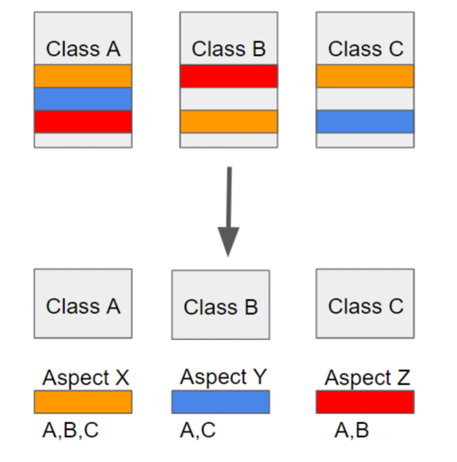
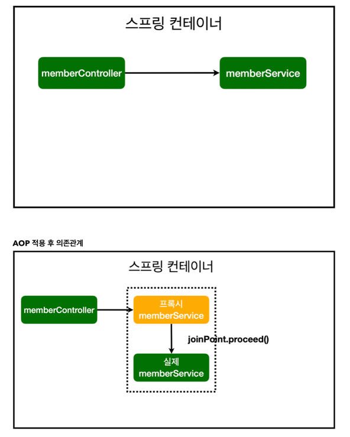
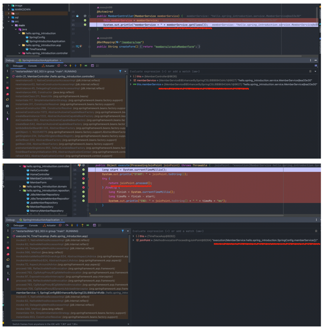

## AOP

### 1. AOP이란?

> ### AOP(Aspect Oriented Programming)

* AOP는 Aspect Oriented Programming의 약자로 관점 지향 프로그래밍이라고 불림
* 즉, 어떤 로직을 기준으로 핵심적인 관점, 공통적인 관점으로 나누어서 보고 그 관점을 기준으로 각각을 모듈화하겠다는 의미!

* 핵심적인 관점: 우리가 적용하고자 하는 비즈니스 로직
* 공통적인 관점: 핵심 로직을 실행하기 위해서 행해지는 데이터베이스 연결, 로깅, 파일 입출력, 시간 측정 등


### 2. 공통적인 관점에 해당하는 로직의 특징?

* 애플리케이션의 전 영역에서 나타날 수 있음
* 중복 코드를 만들어낼 가능성 때문에 유지보수가 힘들어짐
* 비즈니스 로직과 함께 있으면 비즈니스 로직을 이해하기 어려워짐


> ### 결론:  두 관심사를 분리하자!   




AOP에서 각 관점을 기준으로 로직을 모듈화한다는 것은 코드들을 부분적으로 나누어서 모듈화하겠다는 의미   
이때, 소스 코드상에서 다른 부분에 계속 반복해서 쓰는 코드들을 발견할 수 있는 데 이것을 흩어진 관심사(Crosscutting Concerns)라 함

> #### ✨위와 같이 흩어진 공통적인 관심사를 Aspect로 모듈화하고 핵심적인 비즈니스 로직에서 분리하여 재사용하자 == AOP 취지✨


### 3. AOP의 주요 개념

* **Aspect**: 위에서 설명한 흩어진 공통적인 관심사를 모듈화 한 것
* **Target**: Aspect를 적용하는 곳 (클래스, 메서드, ...)
* **Advice**: 실질적으로 부가기능을 담은 구현체
* **JointPoint**: Advice가 적용될 위치, 끼어들 수 있는 지점


### 4. Spring AOP 특징

* 프록시 패턴 기반의 AOP 구현체, 프록시 객체를 쓰는 이유는 접근 제어 및 부가기능을 추가하기 위해
* 스프링 빈에만 AOP를 적용 가능


### 5. 코드 예시

```java
// TimeTraceAop.java

@Aspect
@Component
public class TimeTraceAop {

    @Around("execution(* hello.spring_introduction..*(..))")
    public Object execute(ProceedingJoinPoint joinPoint) throws Throwable {
        long start = System.currentTimeMillis();
        System.out.println("START: " + joinPoint.toString());
        try {
            return joinPoint.proceed();
        } finally {
            long finish = System.currentTimeMillis();
            long timeMs = finish - start;
            System.out.println("END: " + joinPoint.toString() + " " + timeMs + "ms");
        }
    }
}
```

* Springboot 컨테이너 띄웠을 때

```shell
START: execution(MemberService hello.spring_introduction.SpringConfig.memberService())
END: execution(MemberService hello.spring_introduction.SpringConfig.memberService()) 5ms
memberService = class hello.spring_introduction.service.MemberService$$EnhancerBySpringCGLIB$$6c96ebc3
```

* 작동 방식



* 직접 디버그로 확인해보기




* local에서 회원 목록 조회 시
  * Controller -> Service -> Repository로 접근하는 것 확인 가능

```shell
START: execution(String hello.spring_introduction.controller.MemberController.list(Model))
START: execution(List hello.spring_introduction.service.MemberService.findMembers())
START: execution(List org.springframework.data.jpa.repository.JpaRepository.findAll())
Hibernate: select member0_.id as id1_0_, member0_.name as name2_0_ from member member0_
END: execution(List org.springframework.data.jpa.repository.JpaRepository.findAll()) 179ms
END: execution(List hello.spring_introduction.service.MemberService.findMembers()) 183ms
END: execution(String hello.spring_introduction.controller.MemberController.list(Model)) 233ms
```

