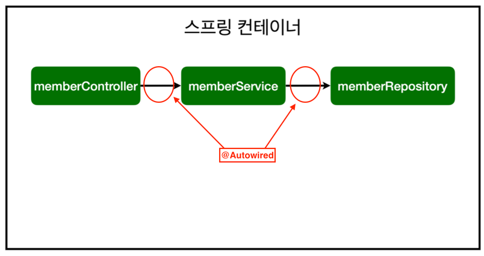
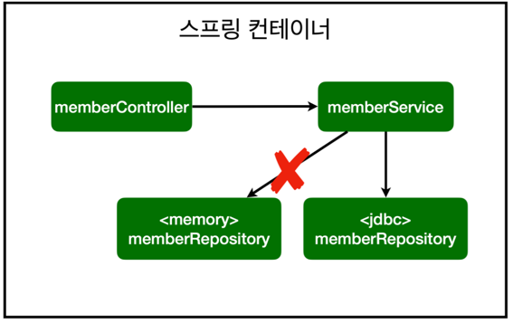

## 의존성 주입 (Dependency Injection)

## 1. 의존성 주입이란?

Spring 프레임워크의 핵심 프로그래밍 모델 중 하나가 바로 "의존성 주입(Dependency Injection, DI)" 입니다.

> DI란 **외부에서 두 객체 간의 관계를 결정해주는 디자인 패턴**으로,   
> **인터페이스를 사이에 둬서   
> 클래스 레벨에서는 의존관계가 고정되지 않도록 하고,   
> 런타임 시에 관계를 동적으로 주입**하여   
> 유연성을 확보하고 결합도를 낮출 수 있게 해줍니다.

> **의존성**이란 한 객체가 다른 객체를 사용할 때 의존성이 있다고 합니다.

```java
@Controller
public class MemberController {
    
    private final MemberService memberService;
    
    public MemberController() {
        this.memberService = new MemberService();
    }
}
```

위 예제에서 보면,   
다음과 같이 MemberController 객체가 MemberSerivce 객체를 사용합니다.   

이 경우, MemberController 객체가 MemberService 객체에 의존성이 있다고 표현합니다.


> **의존성 주입(Dependency Injection, DI)**:  두 객체 간의 관계(의존성)를 맺어주는 것
>
> * **생성자 주입** 👍🏻
> * 필드 주입
> * setter에서 주입


## 2. 의존성 주입이 필요한 이유

```java
@Controller
public class MemberController {
    
    private final MemberService memberService;
    
    public MemberController() {
        this.memberService = new MemberService();
    }
}
```

해당 예시 클래스는 다음과 같은 문제점을 가지고 있습니다.
* 두 클래스가 강하게 결합되어 있다
* ~~객체들 간의 관계가 아니라~~ 클래스 간의 관계가 맺어져 있다.


### 🔎 문제 분석

> 1. 두 클래스가 강하게 결합되어 있다

위와 같은 MemberController 클래스는 현재 MemberService 클래스와 강하게 결합되어 있다는 문제점을 가지고 있습니다.   
두 클래스가 강하게 결합되어 있어서 만약 MemberController 에서 MemberService 가 아닌 다른 서비스 클래스를 이용하고자 한다면   
MemberController 클래스의 생성자에 변경이 필요하다. **즉, 유연성이 떨어진다.**

> 2. ~~객체들 간의 관계가 아니라~~ 클래스 간의 관계가 맺어진다

위의 예시는 MemberController 클래스와 MemberService 클래스 간의 관계가 맺어져 있다는 문제가 있다.   
올바른 객체지향적 설계라면 클래스가 아닌 **객체들 간에 관계가 맺어져야 한다.**  
객체들 간의 관계가 맺어졌다면 다른 객체의 구현 클래스를 전혀 알지 못하더라도, (해당 클래스가 인터페이스를 구현했다면) 인터페이스 타입으로 사용할 수 있다.   


결국 위와 같은 문제점이 발생하는 근본적인 이유는 MemberController에서 어떤 MemberService를 사용할 지에 대한 **"관심이 불리되지 않았기 때문"**이다.   
Spring에서는 DI(의존성 주입)를 적용하여 이러한 문제를 해결합니다.


## 3. 의존성 주입을 통한 문제 해결

✨회원 컨트롤러가 회원 서비스와 회원 리포지토리를 사용할 수 있게 의존관계 설정하기✨

* 회원 컨트롤러에 의존관계 추가

```java
@Controller
public class MemberController{
    
    private final MemberService memberService;
    
    @Autowired
    public MemberController(MemberService memberService){
        this.memberService = memberService;
    }
}
```

```java
@Service
public class MemberService {
    
    private final MemberRepository memberRepository;
    
    @Autowired
    public MemberService(MemberRepository memberRepository) {
        this.memberRepository = memberRepository;
    }
}
```

```java
@Repository
public class MemoryMemberRepository implements MemberRepository {}
```

* @Component 를 포함하는 어노테이션을 통해 스프링 빈으로 자동으로 등록된다
  * @Controller, @Service, @Repository 로 스프링 컨테이너에 스프링 빈으로 자동으로 등록된다
* 생성자에 ```@Autowired```가 있으면 스프링이 연관된 객체를 스프링 컨테이너에 찾아서 넣어준다
  * 이렇게 객체 의존관계를 외부에서 넣어주는 것을 DI(Dependency Injection), 의존성 주입이라고 한다
  * ```@Autowired```에 의해 스프링이 직접 주입해준다




* 참고: 스프링은 스프링 컨테이너에 스프링 빈을 등록할 때, 기본으로 싱글톤으로 등록한다
  * 유일하게 하나만 등록해서 공유 -> 따라서 같은 스프링 빈이면 모두 같은 인스턴스임
* 설정으로 싱글톤이 아니게 설정할 수 있지만, 특별한 경우를 제외하면 대부분 싱글톤을 사용


* DI를 이용해 다른 서비스 클래스 이용하기



## 4. 의존성 주입 최종 정리

한 객체가 어떤 객체(구체 클래스)에 의존할 것인지는 별도의 관심사다.  
Spring은 **의존성 주입을 도와주는** DI 컨테이너로써, **강하게 결합된 클래스들을 분리**하고, 애플리케이션 실행 시점에 **객체 간의 관계를 결정**해 줌으로써   
**결합도를 낮추고 유연성을 확보**해준다. 이런 방법은 상속보다 훨씬 유연하다.   
단, 한 객체가 다른 객체를 주입받으려면 반드시 DI 컨테이너에 의해 관리되어야 한다.
  * 두 객체 간의 관계라는 관심사의 분리
  * 두 객체 간의 결합도를 낮춤
  * 객체의 유연성을 높임
  * 테스트 작성을 용이하게 함