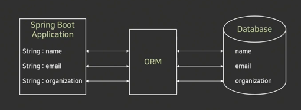
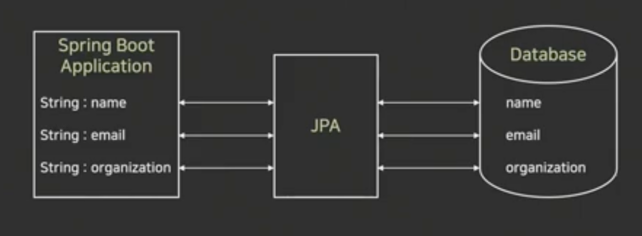
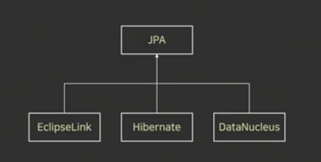
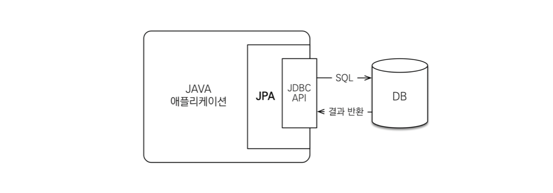
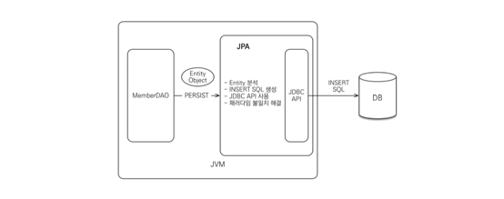
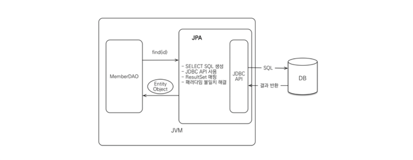
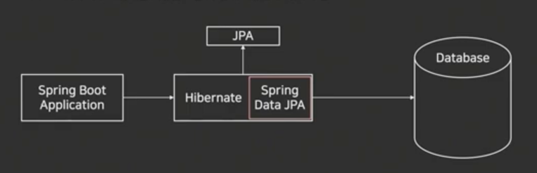
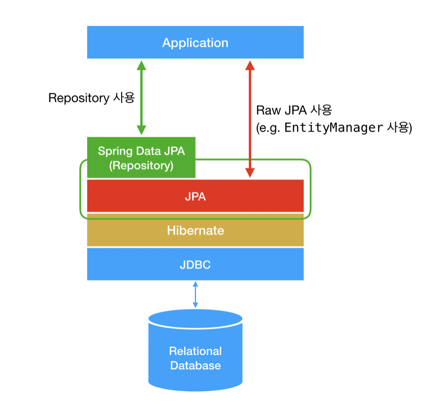
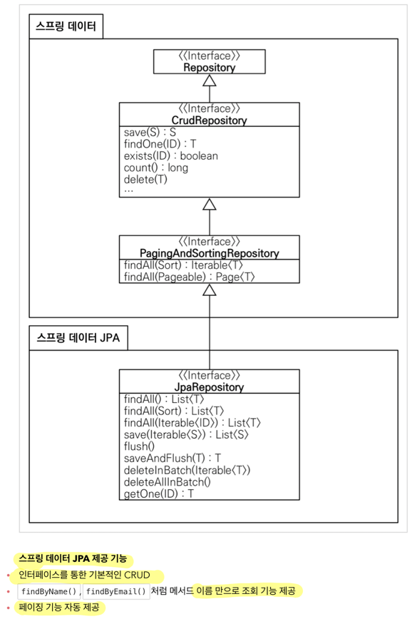

## JPA

### 1. ORM이란?

> ### ORM(Object Relational Mapping)

* 어플이션의 객체와 관계형 데이터베이스의 데이터를 자동으로 매핑해주는 것을 의미
  * Java의 데이터 클래스와 관계형 데이터베이스의 테이블을 매핑

* 객체지향 프로그래밍과 관계형 데이터베이스의 차이로 발생하는 제약사항을 해결해주는 역할을 수행
* 대표적으로 JPA가 있음




### 2. ORM의 장점?

* SQL 쿼리가 아닌 직관적인 코드로 데이터를 조작할 수 있음
  * 개발자가 보다 비즈니스 로직에만 집중할 수 있음
  * 장점이자 단점임
* 재사용 및 유지보수가 편리
  * ORM은 독립적으로 작성되어 있어 재사용이 가능
  * 매핑정보를 명확하게 설계하기 때문에 따로 데이터베이스를 볼 필요가 없음
* DBMS에 대한 종속성이 줄어듦
  * DBMS를 교체하는 작업을 비교적 적은 리스크로 수행 가능


### 3. ORM의 단점?

* 복잡성이 커질 경우 ORM만으로 구현하기 어려움
  * 직접 쿼리를 구현하지 않아 복잡한 설계가 어려움
* 잘못 구현할 경우 속도 저하 발생
  * 코드를 쿼리로 converting해주는 작업이기 때문에 잘못 작성했을 경우 그만큼 converting하는데 시간 소요
* 대형 쿼리는 별도의 튜닝이 필요할 수 있음


### 4. JPA?

> ### JPA(Java Persistance API)

* JPA는 Java Persistance API의 줄임말이며, ORM과 관련된 인터페이스의 모음
* Java 진영에서 표준 ORM으로 채택되어 있음
* ORM이 큰 개념이라고 하면, JPA는 더 구체화시킨 스펙을 포함하고 있음 (JPA - 구현체)
* JPA는 기존의 반복 코드는 물론이고, 기본적인 SQL도 JPA가 직접 만들어서 실행
* JPA를 사용하면 SQL과 데이터 중심의 설계에서 **객체 중심의 설계**로 패러다임을 전환할 수 있음




### 5. Hibername?

> ### Hibernate

* JPA의 인터페이스를 구현한 대표적인 오픈소스로 Hibernate, EclipseLink, DataNucleus가 있음
* JPA라는 ORM 기술 표준을 구현한 것이 Hibernate이므로, JPA를 사용하려면 개발자는 Hibernate를 사용하면 됨
  * 현재 JPA 구현체 중 가장 많이 사용됨




### 6. JPA 동작 과정

> ### 기본 구조



* JPA의 동작은 JDBC와 애플리케이션 사이에서 동작하며, 개발자가 JPA를 사용하면 JPA가 JDBC API를 사용해 SQL을 호출하여 DB와 통신하는 방식
* 개발자는 JDBC API를 사용하는 것이 아닌 JPA만을 사용함

> ### 객체 저장



JPA를 사용하여 객체를 저장할 때
1. 개발자가 JPA에 객체를 넘긴다
2. JPA는 Member entity를 분석한다 
3. JPA가 분석된 정보를 통해 insert SQL을 생성한다
4. JDBC API를 사용하여 SQL문을 DB에 날린다


> ### 객체 조회



JPA를 사용하여 객체를 조회할 때
1. 개발자가 조회하고자 하는 객체의 PK값을 JPA에 넘긴다
2. JPA는 엔티티의 매핑 정보를 바탕으로 SELECT SQL을 생성한다
3. JDBC API를 사용하여 SQL문을 DB에 날린다
4. DB로부터 결과를 받아와 객체에 매핑시킨다


> ### 예시 코드

```java
// JdbcTemplateMemberRepository

public class JdbcTemplateMemberRepository implements MemberRepository {
  private final JdbcTemplate jdbcTemplate;
  public JdbcTemplateMemberRepository(DataSource dataSource) {
    jdbcTemplate = new JdbcTemplate(dataSource);
  }
  @Override
  public Member save(Member member) {
    SimpleJdbcInsert jdbcInsert = new SimpleJdbcInsert(jdbcTemplate);
    jdbcInsert.withTableName("member").usingGeneratedKeyColumns("id");

    Map<String, Object> parameters = new HashMap<>();
    parameters.put("name", member.getName());

    Number key = jdbcInsert.executeAndReturnKey(new MapSqlParameterSource(parameters));
    member.setId(key.longValue());
    return member;
  }
  @Override
  public Optional<Member> findById(Long id) {
    List<Member> result = jdbcTemplate.query("select * from member where id = ?", memberRowMapper(), id);
    return result.stream().findAny();
  }
  @Override
  public List<Member> findAll() {
    return jdbcTemplate.query("select * from member", memberRowMapper());
  }
  @Override
  public Optional<Member> findByName(String name) {
    List<Member> result = jdbcTemplate.query("select * from member where name = ?", memberRowMapper(), name);
    return result.stream().findAny();
  }
  private RowMapper<Member> memberRowMapper() {
    return (rs, rowNum) -> {
      Member member = new Member();
      member.setId(rs.getLong("id"));
      member.setName(rs.getString("name"));
      return member;
    };
  }
}


// JpaMemberRepository

public class JpaMemberRepository implements MemberRepository {

  private final EntityManager em;

  public JpaMemberRepository(EntityManager em) {
    this.em = em;
  }

  @Override
  public Member save(Member member) {
    em.persist(member);
    return member;
  }

  @Override
  public Optional<Member> findById(Long id) {
    Member member = em.find(Member.class, id);
    return Optional.ofNullable(member); // 조회할 type, pk
  }

  @Override
  public Optional<Member> findByName(String name) {
    List<Member> result = em.createQuery("select m from Member m where m.name = :name", Member.class)
            .setParameter("name", name)
            .getResultList();

    return result.stream().findAny();
  }

  @Override
  public List<Member> findAll() {
    return em.createQuery("select m from Member m", Member.class)
            .getResultList();
  }
}
```

* 왜 JPA를 써야 하는가? https://dbjh.tistory.com/77


### 7. Spring Data JPA

> ### Spring Data JPA

* Spring Framework에서 JPA를 편리하게 사용할 수 있게 지원하는 **라이브러리**
  * CRUD 처리용 인터페이스 제공
  * Repository 개발 시 인터페이스만 작성하면 구현 객체를 동적으로 생성해서 주입
  * 데이터 접근 계층 개발시 **인터페이스만 작성해도 됨**
* Hibernate에서 자주 사용되는 기능을 좀 더 쉽게 사용할 수 있게 구현
  * 반복 개발해온 기본 CRUD 기능도 스프링 데이터 JPA가 모두 제공




> ### 전체 구조 확인




> ### 예시 코드

```java

// JpaMemberRepository

public class JpaMemberRepository implements MemberRepository {

  private final EntityManager em;

  public JpaMemberRepository(EntityManager em) {
    this.em = em;
  }

  @Override
  public Member save(Member member) {
    em.persist(member);
    return member;
  }

  @Override
  public Optional<Member> findById(Long id) {
    Member member = em.find(Member.class, id);
    return Optional.ofNullable(member); // 조회할 type, pk
  }

  @Override
  public Optional<Member> findByName(String name) {
    List<Member> result = em.createQuery("select m from Member m where m.name = :name", Member.class)
            .setParameter("name", name)
            .getResultList();

    return result.stream().findAny();
  }

  @Override
  public List<Member> findAll() {
    return em.createQuery("select m from Member m", Member.class)
            .getResultList();
  }
}


// SpringDataJpaMemberRepository

public interface SpringDataJpaMemberRepository extends JpaRepository<Member, Long>, MemberRepository  {

  Optional<Member> findByName(String name);
}

// 스프링 데이터 JPA가 SpringDataJpaMemberRepository 를 스프링 빈으로 자동 등록해준다

```

