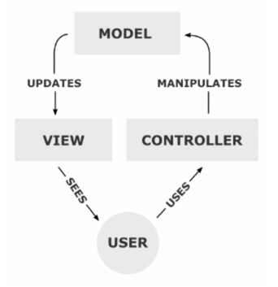
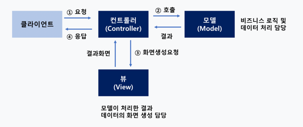
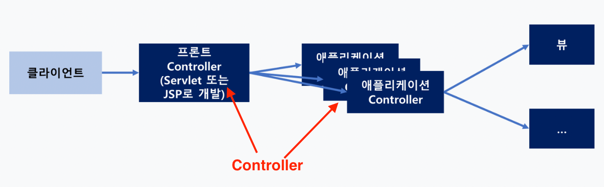
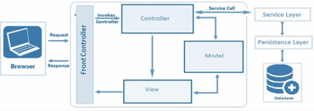
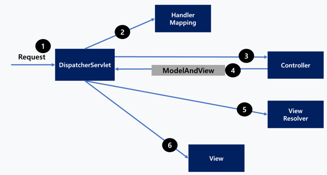

## Spring MVC

## 1. MVC 패턴의 개념(복습)

> **모델-뷰-컨트롤러(Model-View-Controller, MVC)**:  소프트웨어 공학에서 사용되는 아키텍처 패턴으로 MVC 패턴의 주 목적은 Business logic과 Presentation logic을 분리하기 위함이다.

MVC 패턴을 사용하면, 사용자 인터페이스로부터 비지니스 로직을 분리하여 애플리케이션의 시각적 요소나 그 이면에서 실행되는 비지니스 로직을 **서로 영향 없이** 쉽게 고칠 수 있는 애플리케이션을 만들 수 있다
* Model : 애플리케이션의 정보 (데이터)
* View : 사용자에게 제공할 화면 (Presentation Logic)
* Controller : Model과 View 사이의 상호 작용을 관리

MVC 패턴은 Layer들 중에서도 Presentation Layer를 더 세분화하여 나눈 패턴이다.
Java에서는 MVC 패턴을 모델 2 아키텍처라고도 부른다.

실질적으로 클라이언트는 컨트롤러와 직접 소통을 하게 됩니다.   
요청 접수도, 결과 응답도 컨트롤러가 수행합니다.  

## 2. Front Controller 패턴 아키텍처

> * **Front Controller 프로세스**
>  *  Front Controller는 클라이언트가 보낸 요청을 받아서 공통적인 작업을 먼저 수행
>  *  Front Controller는 적절한 세부 Controller에게(개발해야 할 부분) 작업을 위임
>  *  각각의 애플리케이션 Controller는 클라이언트에게 보낼 뷰를 선택해서 최종 결과를 생성하는 작업
>  *  Front Controller 패턴은 **인증이나 권한 체크**처럼, 모든 요청에 대하여 공통적으로 처리해야 하는 로직이 있을 경우 전체적으로 클라이언트의 요청을 중앙 집중적으로 관리하고자 할 경우에 사용

=> 즉, 컨트롤러를 Front/애플리케이션 컨트롤러로 세분화해서 나눈 아키텍처   
=> Front Controller가 적절한 애플리케이션 Controller를 호출하는 식의 프로세스   
=> Front Controller는 Spring에서 이미 제공하기 때문에 직접 구현할 필요가 없음   

## 3. Spring MVC 특징

* Spring은 DI나 AOP와 같은 기능뿐만 아니라, 서블릿 기반의 웹 개발을 위한 MVC 프레임워크를 제공
* Spring MVC는 모델2 아키텍처와 Front Controller 패턴을 프레임워크 차원에서 제공
* Spring MVC 프레임워크는 Spring을 기반으로 하고 있기 때문에 Spring이 제공하는 트랜잭션 처리나 DI 및 AOP등을 손쉽게 사용

## 4. Spring MVC와 Front Controller 패턴

* 대부분의 MVC 프레임워크들은 Front Controller 패턴을 적용해서 구현
* Spring MVC도 Front Controller 역할을 하는 **DispatcherServlet** 이라는 클래스를 계층의 맨 앞단에 놓고, 서버로 들어오는 모든 요청을 받아서 처리하도록 구성
* 예외가 발생했을 때 일관된 방식으로 처리하는 것도 Fornt Controller의 역할

## 5. Spring MVC의 주요 구성 요소

* **DispatcherServlet**
  * 클라이언트의 요청을 받아서 Controller에게 클라이언트의 요청을 전달하고, 리턴한 결과값을 View에게 전달하여 알맞은 응답을 생성
* **HandlerMapping**
  * URL과 요청 정보를 기준으로 어떤 핸들러 객체를 사용할지 결정하는 객체이며, DispatcherServlet은 하나 이상의 핸들러 매핑을 가질 수 있음
* **Controller**
  * 클라이언트 요청을 처리한 뒤, Model을 호출하고 그 결과를 DispatcherServlet에게 알려 줌

* **View**
  * View의 이름(jsp 파일 이름) 즉, 정보를 보유하는 객체
* **ViewResolver**
  * Controller에게 어떤 View를 선택할지 결정
* **ModelAndView**
  * View의 이름과 View에 바인딩 되어야 할 데이터인 모델 객체를 모두 포함하는 객체

## 6. Spring MVC의 요청 처리 과정

✔ DispatcherServlet이 요청을 받음   
✔ 안에 있는 HandlerMapping 클래스에 의해서 적절한 Controller가 결정   
✔ 그 결정에 따라 해당 Controller를 호출   
✔ Controller는 DispatcherServlet에 ModelAndView를 전달 (여기에는 데이터와 JSP파일 이름이 있음)  
✔ DispatcherServlet는 ViewResolver를 통해 View를 확보하게 되고 이를 클라이언트에게 응답

> ### 참고
> * @ResponseBody를 쓰면 ViewResolver를 사용하지 ❌
>   * REST API: 보통 객체를 JSON 형태로 반환하는 형태