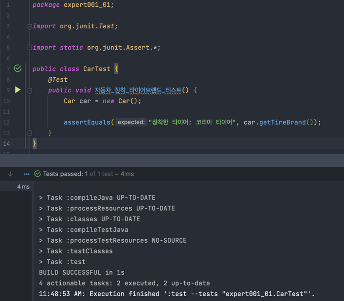
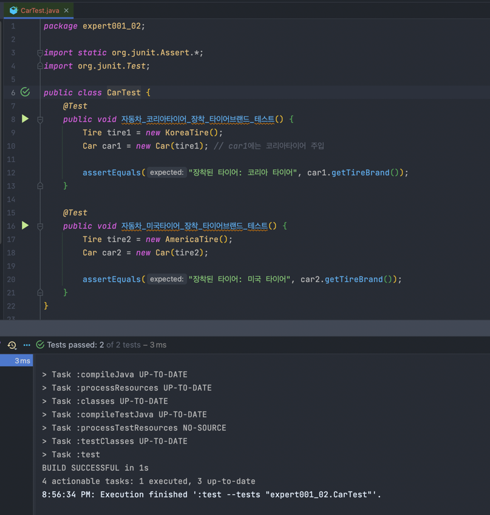
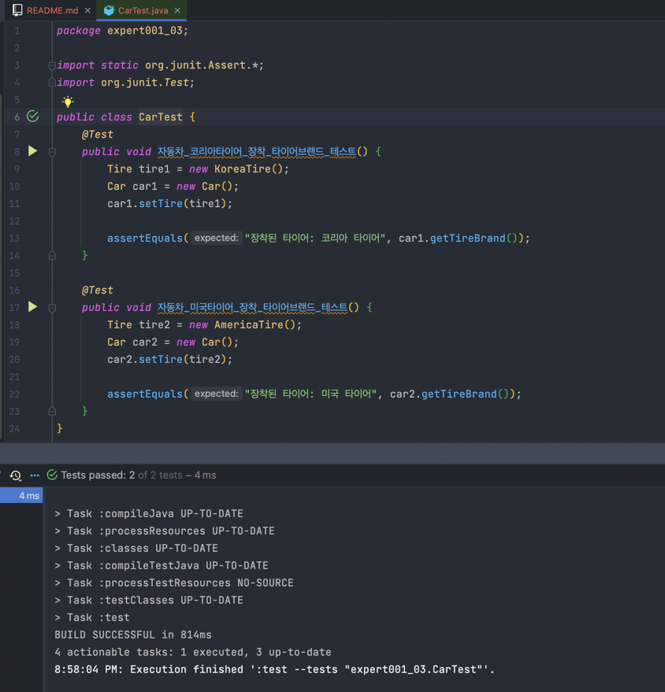
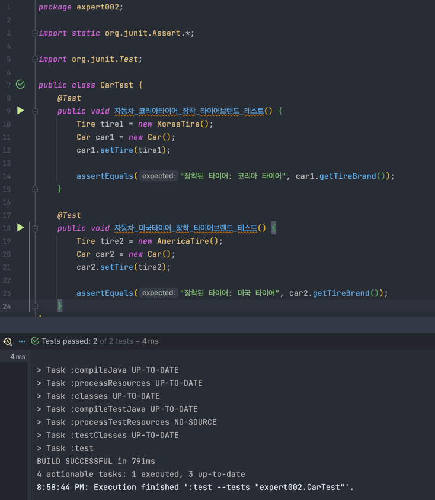
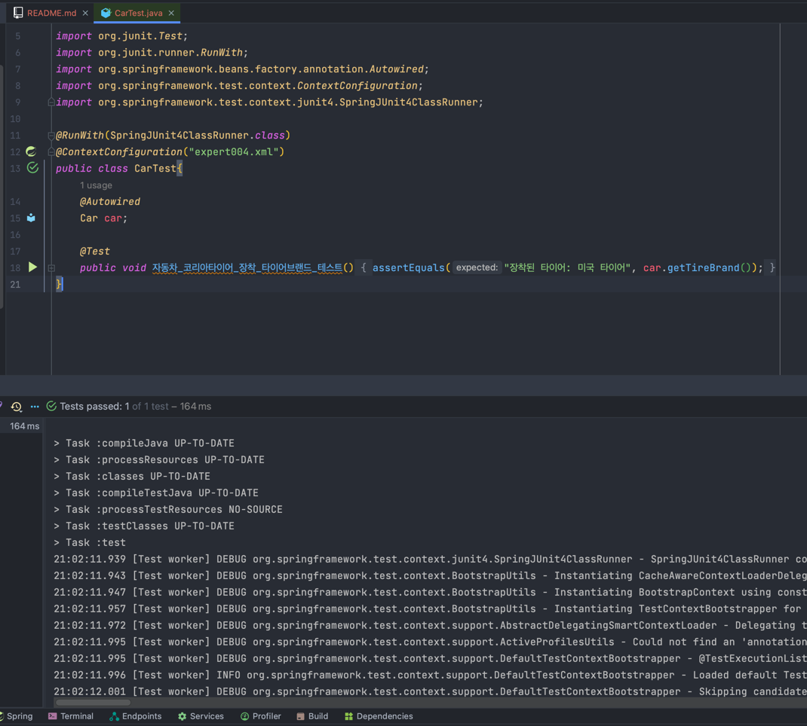

# 📝 IoC/DI - 제어의 역전/의존성 주입

```java
new Car();
Car 생성자에서 new Tire(); // Car가 Tire에 의존한다
```

* 전체가 부분에 의존한다
* 프로그래밍에서 의존 관계는 new로 표현된다   


* 목차
  *  1) (스프링 ❌) 생성자를 통한 의존성 주입 1
  *  2) (스프링 ❌) 생성자를 통한 의존성 주입 2
  *  3) (스프링 ❌) 속성을 통한 의존성 주입
  *  4) (스프링 ⭕️) XML 파일 사용
  *  5) (스프링 ⭕️) 스프링 설정 파일(XML)에서 속성 주입   
  *  6) (스프링 ⭕️) @Autowired를 통한 속성 주입   
  *  7) (스프링 ⭕️) @Resource를 통한 속성 주입   
  
---

## 1) (스프링 ❌) 생성자를 통한 의존성 주입 1

```java
// Tire.java

package expert001_01;

public interface Tire {
  String getBrand();
}
```

```java
// KoreaTire.java

package expert001_01;

public class KoreaTire implements Tire{

  public String getBrand() {
    return "코리아 타이어";
  }
}
```

```java
// AmericaTire.java

package expert001_01;

public class AmericaTIre implements Tire {
  public String getBrand() {
    return "미국 타이어";
  }
}
```

```java
// Car.java

package expert001_01;

public class Car {
  Tire tire;

  public Car() { // 생성자를 통한 의존성 주입
    tire = new KoreaTire(); // 자동차가 타이어를 생산하는 부분 // 의존 관계가 일어나고 있는 부분
    // 여기서는 Car 객체가 Tire를 직접 생산하는,
    // 즉 Tire에 대한 의존성을 자체적으로 해결하는 방식
  }

  public String getTireBrand() {
    return "장착한 타이어: " + tire.getBrand();
  }
}
```

```java
// Driver.java

package expert001_01;

public class Driver {
  public static void main(String[] args){
    Car car = new Car();
    System.out.println(car.getTireBrand());
  }
}
```

> ### ⭐️ 특징 정리   
> ```
> public Car() {
> tire = new KoreaTire();
> }
> ```
> * 생성자를 통한 의존성 주입
> * Car 객체가 Tire를 직접 만들어서 주입
> * 유연성이 떨어짐

* 테스트코드 결과


---

## 2) (스프링 ❌) 생성자를 통한 의존성 주입 2

```java
// Car.java

package expert001_02;

public class Car {
  Tire tire;

  public Car(Tire tire) { // Car의 생성자에 인자가 생김
    this.tire = tire; // new가 사라지고 //  외부에서 생산된 tire 객체를 Car의 생산자의 인자로 주입하는 형태
  }

  public String getTireBrand() {
    return "장착된 타이어: " + tire.getBrand();
  }
}
```

```java
// Driver.java

package expert001_02;

public class Driver {
  public static void main(String[] args) {
    Tire tire = new KoreaTire(); // 운전자가 타이어를 선택
    Car car = new Car(tire); // "만들어진" tire 객체를 car에 주입

    System.out.println(car.getTireBrand());
  }
}
```


> ### ⭐️ 특징 정리
>
> * Car의 생성자에 Tire 인자를 받음
> * 인자로 받은 객체로 의존성 주입
>   * Car는 그저 Tire 인터페이스를 구현한 어떤 객체가 들어오기만 하면 됨
> * 새로운 타이어 브랜드가 생겨도 Tire 인터페이스만 구현해준 뒤에 Driver에서만 주입해주면 됨
> * 유연성과 확장성 증가


* 테스트코드 결과


---

## 3) (스프링 ❌) 속성을 통한 의존성 주입

* 처음 생성될 때 주입해주는 게 아니라, 원하는 시점에 의존성 주입하기


```java
// Car.java

package expert001_03;

public class Car {
  Tire tire;

  public Tire getTire() {
    return tire;
  }

  public void setTire(Tire tire) { // 속성을 통한 의존성 주입
    this.tire = tire;
  }

  public String getTireBrand() {
    return "장착된 타이어: " + tire.getBrand();
  }
}
```

```java
// Driver.java

package expert001_03;

public class Driver {
  public static void main(String[] args) {
    Tire tire = new KoreaTire();
    Car car = new Car();
    car.setTire(tire);

    System.out.println(car.getTireBrand());
  }
}
```

> ### ⭐️ 특징 정리
>
> * ~~생성자가 아닌~~ 속성을 통한 의존성 주입
> * 원하는 시점에 의존성 주입 가능
> * 하지만, 생성자를 통한 의존성 주입이 더 많이 선호됨
>   * 프로그램에서는 한번 주입된 의존성을 계속 사용하는 경우가 더 일반적이기 때문


* 테스트코드 결과


---

## 4) (스프링 ⭕️) XML 파일 사용 -> 속성을 통한 의존성 주입

* 스프링을 통한 의존성 주입
  * 생성자를 통한 의존성 주입
  * 속성을 통한 의존성 주입


```java
// expert002.xml

<?xml version="1.0" encoding="UTF-8"?>
<beans xmlns="http://www.springframework.org/schema/beans"
        xmlns:xsi="http://www.w3.org/2001/XMLSchema-instance"
        xsi:schemaLocation="http://www.springframework.org/schema/beans http://www.springframework.org/schema/beans/spring-beans.xsd">

<bean id="tire" class="expert002.KoreaTire"></bean>  <!-- KoreaTire가 id=tire 값으로 빈에 등록 -->
<bean id="americaTire" class="expert002.AmericaTire"></bean>  <!-- AmericaTire가 id=americaTire 값으로 빈에 등록 -->
<bean id="car" class="expert002.Car"></bean>  <!-- Car를 car 값으로 빈에 등록 -->

</beans>
```

```java
// Driver.java

package expert002;

import org.springframework.context.ApplicationContext;
import org.springframework.context.support.ClassPathXmlApplicationContext;

public class Driver {
  public static void main(String[] args) {

    ApplicationContext context = new ClassPathXmlApplicationContext("expert002/expert002.xml");

    Car car = context.getBean("car", Car.class); // 빈에서 등록된 걸 가져옴 // (구매)

    Tire tire = context.getBean("tire", Tire.class); // 빈에서 등록된 걸 가져옴 // (구매)

    car.setTire(tire); // 스프링을 통한 의존성 주입 (xml 파일 이용) + 속성을 통한 주입

    System.out.println(car.getTireBrand());
  }
}
```

* Driver.java 파일 실행 시
```shell
> Task :compileJava UP-TO-DATE
> Task :processResources
> Task :classes

> Task :Driver.main()
20:44:58.785 [main] DEBUG org.springframework.context.support.ClassPathXmlApplicationContext - Refreshing org.springframework.context.support.ClassPathXmlApplicationContext@87f383f
20:44:58.910 [main] DEBUG org.springframework.beans.factory.xml.XmlBeanDefinitionReader - Loaded 3 bean definitions from class path resource [expert002/expert002.xml]
20:44:58.928 [main] DEBUG org.springframework.beans.factory.support.DefaultListableBeanFactory - Creating shared instance of singleton bean 'tire'
20:44:58.934 [main] DEBUG org.springframework.beans.factory.support.DefaultListableBeanFactory - Creating shared instance of singleton bean 'americaTire'
20:44:58.934 [main] DEBUG org.springframework.beans.factory.support.DefaultListableBeanFactory - Creating shared instance of singleton bean 'car'
장착된 타이어: 코리아 타이어
```


> ### ⭐️ 특징 정리
>
> * 스프링을 도입해서 얻는 이점
>   * 재컴파일/재배포하지 않아도 XML 파일만 수정하면 프로그램의 실행 결과를 바꿀 수 있음
>   * XML 파일을 변경하고 프로그램을 실행하면 바로 변경사항이 적용됨


* 테스트코드 결과


---

## 5) (스프링 ⭕️) 스프링 설정 파일(XML)에서 속성 주입  


```java
// expert003.xml

<?xml version="1.0" encoding="UTF-8"?>
<beans xmlns="http://www.springframework.org/schema/beans"
        xmlns:xsi="http://www.w3.org/2001/XMLSchema-instance"
        xsi:schemaLocation="http://www.springframework.org/schema/beans http://www.springframework.org/schema/beans/spring-beans.xsd">

<bean id="koreaTire" class="expert003.KoreaTire"></bean>

<bean id="americaTire" class="expert003.AmericaTire"></bean>

<bean id="car" class="expert003.Car">
<property name="tire" ref="americaTire"></property>  <!-- Car에서 tire 속성을 설정 -->
</bean>

</beans>
```

```java
// Driver.java

package expert003;

import org.springframework.context.ApplicationContext;
import org.springframework.context.support.ClassPathXmlApplicationContext;

public class Driver {
  public static void main(String[] args) {

    ApplicationContext context = new ClassPathXmlApplicationContext("expert003/expert003.xml");

    Car car = context.getBean("car", Car.class);

    System.out.println(car.getTireBrand());
  }
}
```

* Driver.java 파일 실행 시

```shell
> Task :compileJava UP-TO-DATE
> Task :processResources UP-TO-DATE
> Task :classes UP-TO-DATE

> Task :Driver.main()
20:49:00.337 [main] DEBUG org.springframework.context.support.ClassPathXmlApplicationContext - Refreshing org.springframework.context.support.ClassPathXmlApplicationContext@87f383f
20:49:00.464 [main] DEBUG org.springframework.beans.factory.xml.XmlBeanDefinitionReader - Loaded 3 bean definitions from class path resource [expert003/expert003.xml]
20:49:00.482 [main] DEBUG org.springframework.beans.factory.support.DefaultListableBeanFactory - Creating shared instance of singleton bean 'koreaTire'
20:49:00.488 [main] DEBUG org.springframework.beans.factory.support.DefaultListableBeanFactory - Creating shared instance of singleton bean 'americaTire'
20:49:00.488 [main] DEBUG org.springframework.beans.factory.support.DefaultListableBeanFactory - Creating shared instance of singleton bean 'car'
장착된 타이어: 미국 타이어
```

* 테스트코드 결과


---

## 6) (스프링 ⭕️) @Autowired를 통한 속성 주입

* 스프링 속성 주입 방법 중 @Autowired 이용하기
  * import문 하나와 @Autowired 어노테이션을 이용하면 설정자 메소드를 이용하지 않고도 스프링 프레임워크가 대신 속성을 주입해 준다.


```java
<?xml version="1.0" encoding="UTF-8"?>
<beans xmlns="http://www.springframework.org/schema/beans"
        xmlns:xsi="http://www.w3.org/2001/XMLSchema-instance" xmlns:context="http://www.springframework.org/schema/context"
        xsi:schemaLocation="http://www.springframework.org/schema/beans http://www.springframework.org/schema/beans/spring-beans.xsd
        http://www.springframework.org/schema/context  http://www.springframework.org/schema/context/spring-context-3.1.xsd">

<context:annotation-config />

<bean id="tire" class="expert004.KoreaTire"></bean>

<bean id="americaTire" class="expert004.AmericaTire"></bean>

<bean id="car" class="expert004.Car"></bean>

</beans>
```

```java
// Car.java

package expert004;

import org.springframework.beans.factory.annotation.Autowired;

public class Car {
  @Autowired
  Tire americaTire; // @Autowired로 Car에 americaTire 주입해주기

  public String getTireBrand() {
    return "장착된 타이어: " + americaTire.getBrand();
  }
}
```

* Driver.java 파일 실행 시


```shell
> Task :compileJava UP-TO-DATE
> Task :processResources UP-TO-DATE
> Task :classes UP-TO-DATE

> Task :Driver.main()
20:54:10.693 [main] DEBUG org.springframework.context.support.ClassPathXmlApplicationContext - Refreshing org.springframework.context.support.ClassPathXmlApplicationContext@87f383f
20:54:10.824 [main] DEBUG org.springframework.beans.factory.xml.XmlBeanDefinitionReader - Loaded 8 bean definitions from class path resource [expert004/expert004.xml]
20:54:10.835 [main] DEBUG org.springframework.beans.factory.support.DefaultListableBeanFactory - Creating shared instance of singleton bean 'org.springframework.context.annotation.internalConfigurationAnnotationProcessor'
20:54:10.856 [main] DEBUG org.springframework.beans.factory.support.DefaultListableBeanFactory - Creating shared instance of singleton bean 'org.springframework.context.event.internalEventListenerProcessor'
20:54:10.857 [main] DEBUG org.springframework.beans.factory.support.DefaultListableBeanFactory - Creating shared instance of singleton bean 'org.springframework.context.event.internalEventListenerFactory'
20:54:10.858 [main] DEBUG org.springframework.beans.factory.support.DefaultListableBeanFactory - Creating shared instance of singleton bean 'org.springframework.context.annotation.internalAutowiredAnnotationProcessor'
20:54:10.858 [main] DEBUG org.springframework.beans.factory.support.DefaultListableBeanFactory - Creating shared instance of singleton bean 'org.springframework.context.annotation.internalCommonAnnotationProcessor'
20:54:10.862 [main] DEBUG org.springframework.beans.factory.support.DefaultListableBeanFactory - Creating shared instance of singleton bean 'tire'
20:54:10.867 [main] DEBUG org.springframework.beans.factory.support.DefaultListableBeanFactory - Creating shared instance of singleton bean 'americaTire'
20:54:10.867 [main] DEBUG org.springframework.beans.factory.support.DefaultListableBeanFactory - Creating shared instance of singleton bean 'car'
장착된 타이어: 미국 타이어
```

* 테스트코드 결과
